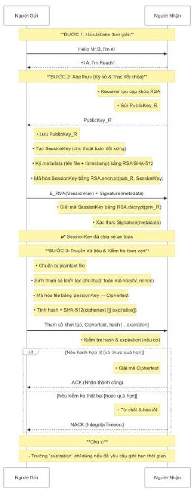

**HƯỚNG DẪN THỰC HIỆN BÀI TẬP LỚN CHO SINH VIÊN** \
*(Học phần: Nhập môn an toàn bảo mật thông tin - Học kì 3 năm học 2025–2026)* 

1. **Mục tiêu của bài tập lớn** 
1. **Về mặt kiến thức** 

Sinh viên vận dụng các thuật toán mã hoá và xác thực đã học như: DES, Triple DES, AES, SHA, RSA để giải quyết các vấn đề bảo mật trong một số ứng dụng thực tế: 

- Hệ thống truyền file an toàn (tài liệu, âm thanh, video); 
- Hệ thống chat an toàn; 
- Bảo mật cơ sở dữ liệu; 
- Xây dựng chương trình trò chơi mô phỏng các thuật toán mật mã học và mô phỏng bảo mật, giáo dục về an ninh mạng. 

Thiết kế và triển khai các giao thức bảo mật trong truyền tải thông tin qua mạng, bao gồm các bước từ kiểm tra kết nối, xác thực danh tính, trao đổi khoá, mã hoá và truyền tải dữ liệu cho đến giải mã và kiểm tra tính toàn vẹn. 

2. **Về mặt kỹ năng** 
- Rèn luyện tư duy xây dựng hệ thống đảm bảo tính bảo mật và tính toàn vẹn. 
- Rèn luyện kỹ năng làm việc nhóm, nghiên cứu, trình bày báo cáo, thuyết trình. 
2. **Yêu cầu chung** 

Sinh viên làm việc theo nhóm từ 2 đến 3 thành viên. Đề tài bài tập lớn do giảng viên chỉ định theo danh sách đề bài ở phần 4. 

1. **Nội dung báo cáo** 
1. Đối với nhóm đề tài truyền tải file dữ liệu, ứng dụng chat an toàn Báo cáo bắt buộc phải gồm các phần: 

1- Đặt vấn đề và phân tích các yêu cầu của bài toán: Mã hoá dữ liệu để đảm bảo tính bảo mật trong quá trình truyền tải. 

2- Mô tả thuật toán và 3 bước sau: 

- Bắt tay (Handshake) đơn giản 
- Xác thực (Ký số và trao đổi khoá) 
- Truyền dữ liệu và kiểm tra toàn vẹn 

Lưu ý: Cần phân tích thuật toán sử dụng để đảm bảo tính bảo mật và tính toàn vẹn của dữ liệu. 

3- Phân tích mã nguồn. 

4- Thử nghiệm với file (như .mp3, .txt,…) / quá trình chat trực tuyến, ghi lại kết quả thời gian thực hiện mã hoá và giải mã cho các file có kích thước khác nhau. Ghi nhận các lỗi trong quá trình thực hiện. 

5- Đánh giá hiệu quả: 

- Sau khi giải mã, dữ liệu nhận được phải giống với dữ liệu gốc. 
- Kiểm tra tính toàn vẹn của dữ liệu được truyền tải. 

6- Phân tích, nhận xét đặc điểm của các thuật toán được sử dụng để xây dựng chương trình. 

7- Đề xuất cải tiến và hướng phát triển chương trình trong tương lai. Các bước thực hiện được mô tả trong hình sau: 

Hình 1: Sơ đồ hệ thống truyền file dữ liệu / chat bảo mật 

2. Đối với nhóm đề tài bảo mật cơ sở dữ liệu Báo cáo bắt buộc phải gồm các phần: 

   1-  Đặt vấn đề và phân tích các yêu cầu của bài toán: 

- Xác định mục tiêu của hệ thống bảo mật: Mã hoá và giải mã dữ liệu sau khi kết nối cơ sở dữ liệu. 
- Đảm bảo rằng dữ liệu nhạy cảm được mã hóa đúng cách trước khi lưu vào cơ sở dữ liệu. 
- Đảm bảo chỉ người có quyền mới có thể giải mã và truy xuất dữ liệu. 
- Các thuật toán mã hóa và giải mã cần phải dễ triển khai và bảo mật. 

2-  Quy trình ứng dụng thuật toán để bảo mật và xác thực dữ liệu 

- Mã hóa dữ liệu: Dữ liệu đầu vào sẽ được mã hóa bằng thuật toán AES, DES hoặc Triple DES trước khi lưu trữ vào cơ sở dữ liệu. Các hàm mã hóa sẽ được gọi sau khi kết nối cơ sở dữ liệu nhưng trước khi dữ liệu được đưa vào bảng dữ liệu. 
- Giải mã dữ liệu: Khi dữ liệu được truy xuất từ cơ sở dữ liệu, các hàm giải mã sẽ được áp dụng để chuyển đổi dữ liệu đã mã hóa về dạng ban đầu. Chỉ người dùng có quyền truy cập và có khóa giải mã sẽ có thể xem được dữ liệu. 

3-  Phân tích mã nguồn 

- Giới thiệu và giải thích mã nguồn của hệ thống bảo mật. 
- Phân tích các phần chính trong mã nguồn: Hàm mã hóa và giải mã, cách thức kết nối cơ sở dữ liệu, và quy trình kiểm tra tính toàn vẹn của dữ liệu. 

4-  Thử nghiệm hệ thống 

- Thực hiện các bài thử nghiệm với các loại dữ liệu khác nhau (dữ liệu nhỏ và dữ liệu lớn). 
- Kiểm tra xem hệ thống có thể xử lý mã hóa/giải mã đúng cách và không có lỗi khi truy xuất dữ liệu. 
- Thực hiện kiểm tra tốc độ mã hóa và giải mã. 

5-  Đánh giá hiệu quả 

- Hiệu quả bảo mật: Đánh giá mức độ bảo mật của hệ thống dựa trên các thuật toán mã hóa được áp dụng. Phân tích khả năng bảo vệ dữ liệu khỏi các cuộc tấn công bên ngoài (ví dụ: tấn công brute force, tấn công man-in-the-middle). 
- Hiệu quả về hiệu suất: Đánh giá tốc độ mã hóa/giải mã của hệ thống khi xử lý các dữ liệu lớn. So sánh thời gian thực hiện mã hóa/giải mã giữa các thuật toán (AES, Triple DES). 

6-  Phân tích đặc điểm và so sánh hiệu suất của thuật toán đang áp dụng với các 

thuật toán khác. 

7-  Đề xuất cải tiến 

- Cải tiến về bảo mật 
- Cải tiến về hiệu suất 
3. Đối với nhóm đề tài: Phát triển game mang tính giáo dục và mô phỏng bảo 

mật 

Báo cáo bắt buộc phải gồm các phần: 

1-  Đặt vấn đề và phân tích các yêu cầu của bài toán: 

- Đặt ra mục tiêu của game là giúp người chơi hiểu và áp dụng các thuật toán mã hóa khác nhau trong từng tình huống bảo mật cụ thể. 
- Phân tích mục tiêu của từng game. 

2-  Mô tả thuật toán và quy trình ứng dụng thuật toán trong mã hoá và giải mã 

- Mã hóa thông điệp: Người chơi áp dụng thuật toán mã hóa vào thông điệp hoặc dữ liệu để bảo vệ chúng trong các tình huống game. 
- Giải mã thông điệp: Người chơi sử dụng kỹ thuật giải mã để lấy lại thông tin từ các thông điệp đã mã hóa. 
- Xác thực và kiểm tra tính toàn vẹn: Trong các game như "Hệ thống mã hóa ngân hàng", người chơi sẽ cần xác thực giao dịch và kiểm tra tính toàn vẹn của thông điệp. 

3-  Phân tích mã nguồn 

- Mô tả chi tiết mã nguồn: Trình bày về cách thức các thuật toán mã hóa được triển khai trong mã nguồn của từng game. Phân tích các hàm mã hóa và giải mã, cách thức mà người chơi tương tác với game thông qua các thuật toán này. 
- Giải thích các phần chính trong mã nguồn: Các đoạn mã thực hiện mã hóa/giải mã (ví dụ: sử dụng thư viện mã hóa trong game engine). Các thuật toán kiểm tra tính toàn vẹn (SHA, DES, RSA) được triển khai trong game. Cách thức tương tác của người chơi với game khi áp dụng thuật toán vào các tình huống bảo mật. 

4-  Thử nghiệm: Đánh giá hiệu quả của từng thuật toán trong việc giúp người chơi 

hoàn thành các nhiệm vụ trong game. 

5-  Đánh giá hiệu quả 

- Hiệu quả bảo mật: Đánh giá mức độ hiệu quả của các thuật toán mã hóa khi áp dụng trong các game mô phỏng bảo mật. Phân tích tính bảo mật của các thuật toán trong game và khả năng bảo vệ thông tin. 
- Hiệu quả về tính khả dụng: Phân tích giao diện người dùng (GUI) và tính dễ sử dụng của game. Đánh giá cách mà người chơi tương tác với các thuật toán trong môi trường game. 

6-  Phân tích và nhận xét đặc điểm của các thuật toán. 

7-  Đề xuất cải tiến. 

2. **Ngôn ngữ lập trình** 

Sinh viên tự do lựa chọn thực hiện bài tập lớn bằng ngôn ngữ  C++, Java hay 

Python. 

3. **Thuật toán và công cụ (tham khảo)** 

Python, thư viện:  

pycryptodome: DES, Triple DES, AES, RSA, SHA-512. cryptography: Diffie-Hellman. 

socket: Kết nối. 

tkinter: GUI. 

4. **Đề tài bài tập lớn** 
1. **Nhóm đề tài truyền file an toàn** 

Sinh viên xây dựng chương trình truyền file an toàn theo hai cấp độ: 

- Local: Giao tiếp giữa hai máy tính 
- Mở rộng trên Internet: làm việc với Cloud/Drive 

**Đề tài 1: Gửi tài liệu email có giới hạn thời gian** 

Mô tả: Công ty A cần chuyển email .txt chứa thông tin nhạy cảm đến nhân viên B, chỉ cho phép mở trong 24 giờ kể từ khi gửi. 

Yêu cầu: 

Mã hóa: AES-CBC 

Trao khóa & ký số: RSA 2048-bit (PKCS#1 v1.5 + SHA-512) Kiểm tra tính toàn vẹn: SHA-512 

Giới hạn thời gian: 24 giờ 

Luồng xử lý: 

Handshake: Người gửi gửi "Hello!". Người nhận trả lời "Ready!". 

Xác  thực  &  Trao  khóa:  Người  gửi  ký  metadata  (tên  file  +  timestamp)  bằng RSA/SHA-512. Người gửi mã hóa SessionKey bằng RSA 2048-bit (PKCS#1 v1.5) và gửi. 

Mã  hóa  &  Kiểm  tra  toàn  vẹn:  Tạo  IV.  Mã  hóa  file  bằng  AES-CBC  để  tạo ciphertext.  Tính  hash:  SHA-512(IV  ||  ciphertext  ||  expiration).  Gói  tin  gửi:  {  "iv": "<Base64>",  "cipher":  "<Base64>",  "hash":  "<hex>",  "sig":  "<Signature>",  "exp": "2025-04-23T09:00:00Z" } 

Phía Người nhận: Kiểm tra hash, chữ ký, và thời hạn (hiện tại ≤ expiration). Nếu tất cả hợp lệ: Giải mã ciphertext bằng AES-CBC, lưu file email.txt, gửi ACK tới Người gửi. Ngược  lại  nếu  hash,  chữ  ký,  hoặc  thời  hạn  không  hợp  lệ:  Từ  chối,  gửi  NACK  (lỗi integrity/timeout) tới Người gửi. 

**Đề tài 2: Gửi báo cáo công ty qua Server trung gian** 

Mô tả: Công ty gửi report.txt qua Server trung gian đến đối tác, yêu cầu lưu log giao dịch tại Server trung gian. 

Yêu cầu: 

Mã hóa: AES-GCM 

Trao khóa & ký số: RSA 1024-bit (OAEP + SHA-512) Kiểm tra tính toàn vẹn: SHA-512 

Lưu log: Thời gian giao dịch 

Luồng xử lý: 

Handshake: Người gửi gửi "Hello!" qua trung gian. Người nhận trả lời "Ready!". Chú thích: Server trung gian không tham gia vào quá trình mã hóa, giải mã, hay kiểm tra bảo mật, chỉ chuyển tiếp dữ liệu và lưu log thời gian (Người gửi khởi tạo, Server trung gian chuyển tiếp, Người nhận xác nhận, tương tự với bước 2 và bước 3). 

Xác thực & Trao khóa: Người gửi ký metadata (tên file + timestamp + ID giao dịch) bằng RSA/SHA-512. Người gửi mã hóa SessionKey bằng RSA 1024-bit (OAEP) và gửi. 

Mã hóa & Kiểm tra toàn vẹn: Tạo nonce. Mã hóa file bằng AES-GCM để tạo ciphertext và tag. Tính hash: SHA-512(nonce || ciphertext || tag). Gói tin gửi: { "nonce": "<Base64>",  "cipher":  "<Base64>",  "tag":  "<Base64>",  "hash":  "<hex>",  "sig": "<Signature>" } 

Phía  Người  nhận:  Kiểm  tra  hash,  chữ  ký,  và  tag.  Nếu  tất  cả  hợp  lệ:  Giải  mã ciphertext bằng AES-GCM, lưu file report.txt, gửi ACK tới Người gửi. Chú thích: Server 

trung gian lưu log thời gian (yêu cầu bổ sung ngoài sơ đồ). Ngược lại nếu hash, chữ ký, hoặc tag không hợp lệ: Từ chối, gửi NACK (lỗi integrity) tới Người gửi. 

**Đề tài 3: Gửi hợp đồng với chữ ký số riêng** 

Mô tả: Gửi contract.txt chia thành 3 phần, mỗi phần được ký số riêng để đảm bảo tính xác thực. 

Yêu cầu: 

Mã hóa: Triple DES 

Trao khóa & ký số: RSA 2048-bit (PKCS#1 v1.5 + SHA-512) Kiểm tra tính toàn vẹn: SHA-512 

Luồng xử lý: 

Handshake: Người gửi gửi "Hello!". Người nhận trả lời "Ready!". 

Xác thực & Trao khóa: Người gửi ký metadata (tên file + timestamp + kích thước) bằng RSA/SHA-512. Người gửi mã hóa SessionKey bằng RSA 2048-bit (PKCS#1 v1.5) và gửi. 

Mã hóa & Kiểm tra toàn vẹn: Tạo IV. Chia file thành 3 phần, mã hóa mỗi phần bằng Triple DES. Ký số từng phần, tính hash: SHA-512(IV || ciphertext). Gói tin gửi (mỗi  phần):  {  "iv":  "<Base64>",  "cipher":  "<Base64>",  "hash":  "<hex>",  "sig": "<Signature>" } 

Phía Người nhận: Kiểm tra hash và chữ ký mỗi phần. Nếu tất cả hợp lệ: Giải mã từng phần bằng Triple DES, ghép và lưu file contract.txt, gửi ACK tới Người gửi. Ngược lại nếu hash hoặc chữ ký không hợp lệ: Từ chối, gửi NACK (lỗi integrity) tới Người gửi. 

**Đề tài 4: Gửi báo cáo tài chính có nén dữ liệu** 

Mô tả: Gửi finance.txt chứa dữ liệu ngân hàng, nén trước để giảm kích thước. Yêu cầu: 

Mã hóa: AES-GCM 

Trao khóa & ký số: RSA 1024-bit (PKCS#1 v1.5 + SHA-512) 

Kiểm tra tính toàn vẹn: SHA-512 

Nén: zlib 

Luồng xử lý: 

Handshake: Người gửi gửi "Hello!". Người nhận trả lời "Ready!". 

Xác thực & Trao khóa: Người gửi ký metadata (tên file + timestamp + loại file) bằng RSA/SHA-512. Người gửi mã hóa SessionKey bằng RSA 1024-bit (PKCS#1 v1.5) và gửi. 

Mã hóa & Kiểm tra toàn vẹn: Nén file bằng zlib. Tạo nonce. Mã hóa file nén bằng AES-GCM để tạo ciphertext và tag. Tính hash: SHA-512(nonce || ciphertext || tag). Gói tin  gửi:  {  "nonce":  "<Base64>",  "cipher":  "<Base64>",  "tag":  "<Base64>",  "hash": "<hex>", "sig": "<Signature>" } 

Phía  Người  nhận:  Kiểm  tra  hash,  chữ  ký,  và  tag.  Nếu  tất  cả  hợp  lệ:  Giải  mã ciphertext bằng AES-GCM, giải nén và lưu file finance.txt, gửi ACK tới Người gửi. Ngược lại nếu hash, chữ ký, hoặc tag không hợp lệ: Từ chối, gửi NACK (lỗi integrity) tới Người gửi. 

**Đề tài 5: Gửi bệnh án với xác thực kép** 

Mô tả: Trong một bệnh viện, bác sĩ cần gửi file medical\_record.txt chứa thông tin bệnh án nhạy cảm của bệnh nhân đến phòng lưu trữ hồ sơ y tế. Để đảm bảo an toàn và tuân thủ quy định bảo mật y tế, hệ thống yêu cầu xác thực kép: chữ ký số để xác minh danh tính bác sĩ và mật khẩu để đảm bảo chỉ nhân viên được ủy quyền mới truy cập được dữ liệu. 

Yêu cầu: 

Mã hóa: AES-CBC 

Trao khóa & ký số: RSA 2048-bit (OAEP + SHA-512) Kiểm tra tính toàn vẹn: SHA-512 

Xác thực: Mật khẩu (SHA-256) 

Luồng xử lý: 

Handshake: Người gửi gửi "Hello!". Người nhận trả lời "Ready!". 

Xác thực & Trao khóa: Người gửi ký metadata (tên file + timestamp + ID bệnh án) bằng RSA/SHA-512. Người gửi gửi hash mật khẩu (SHA-256) và mã hóa SessionKey bằng RSA 2048-bit (OAEP). 

Mã  hóa  &  Kiểm  tra  toàn  vẹn:  Tạo  IV.  Mã  hóa  file  bằng  AES-CBC  để  tạo ciphertext.  Tính  hash:  SHA-512(IV  ||  ciphertext).  Gói  tin  gửi:  {  "iv":  "<Base64>", "cipher": "<Base64>", "hash": "<hex>", "sig": "<Signature>", "pwd": "<SHA256>" } 

Phía Người nhận: Kiểm tra hash, chữ ký, và mật khẩu. Nếu tất cả hợp lệ: Giải mã ciphertext bằng AES-CBC, lưu file medical\_record.txt, gửi ACK tới Người gửi. Ngược 

lại  nếu  hash,  chữ  ký,  hoặc  mật  khẩu  không  hợp  lệ:  Từ  chối,  gửi  NACK  (lỗi integrity/auth) tới Người gửi. 

**Đề tài 6: Gửi bài tập chia thành nhiều phần** 

Mô tả: Một giảng viên cần gửi file assignment.txt chứa bài tập lớn đến hệ thống chấm điểm, chia thành 3 phần để tối ưu băng thông trên mạng hạn chế. File được mã hóa và ký số để đảm bảo an toàn, với tính toàn vẹn được kiểm tra nhằm ngăn chặn sửa đổi trái phép. 

Yêu cầu: 

Mã hóa: DES 

Trao khóa & ký số: RSA 1024-bit (PKCS#1 v1.5 + SHA-512) Kiểm tra tính toàn vẹn: SHA-512 

Luồng xử lý: 

Handshake: Người gửi gửi "Hello!". Người nhận trả lời "Ready!". 

Xác thực & Trao khóa: Người gửi ký metadata (tên file + timestamp + số phần) bằng RSA/SHA-512. Người gửi mã hóa SessionKey bằng RSA 1024-bit (PKCS#1 v1.5) và gửi. 

Mã hóa & Kiểm tra toàn vẹn: Tạo IV. Chia file thành 3 phần, mã hóa mỗi phần bằng DES. Tính hash: SHA-512(IV || ciphertext) cho mỗi phần. Gói tin gửi (mỗi phần): { "iv": "<Base64>", "cipher": "<Base64>", "hash": "<hex>", "sig": "<Signature>" } 

Phía Người nhận: Kiểm tra hash và chữ ký mỗi phần. Nếu tất cả hợp lệ: Giải mã từng phần bằng DES, ghép và lưu file assignment.txt, gửi ACK tới Người gửi. Ngược lại nếu hash hoặc chữ ký không hợp lệ: Từ chối, gửi NACK (lỗi integrity) tới Người gửi. 

**Đề tài 7: Gửi tập tin âm thanh chia thành nhiều đoạn** 

Mô tả: Một nhà sản xuất âm thanh gửi file recording.mp3 chứa bản ghi âm quan trọng đến studio, chia thành 3 đoạn để đảm bảo truyền an toàn qua mạng không ổn định. File được mã hóa và ký số để bảo vệ nội dung, với tính toàn vẹn được kiểm tra nhằm ngăn chặn sửa đổi trái phép. 

Yêu cầu: 

Mã hóa: Triple DES 

Trao khóa & ký số: RSA 2048-bit (OAEP + SHA-512) Kiểm tra tính toàn vẹn: SHA-512 

Luồng xử lý: 

Handshake: Người gửi gửi "Hello!". Người nhận trả lời "Ready!". 

Xác thực & Trao khóa: Người gửi ký metadata (tên file + timestamp + thời lượng) bằng RSA/SHA-512. Người gửi mã hóa SessionKey bằng RSA 2048-bit (OAEP) và gửi. 

Mã hóa & Kiểm tra toàn vẹn: Tạo IV. Chia file thành 3 đoạn, mã hóa mỗi đoạn bằng Triple DES. Tính hash: SHA-512(IV || ciphertext) cho mỗi đoạn. Gói tin gửi (mỗi đoạn): { "iv": "<Base64>", "cipher": "<Base64>", "hash": "<hex>", "sig": "<Signature>" } 

Phía Người nhận: Kiểm tra hash và chữ ký mỗi đoạn. Nếu tất cả hợp lệ: Giải mã từng đoạn bằng Triple DES, ghép và lưu file recording.mp3, gửi ACK tới Người gửi. Ngược lại nếu hash hoặc chữ ký không hợp lệ: Từ chối, gửi NACK (lỗi integrity) tới Người gửi. 

**Đề tài 8: Gửi CV an toàn có kiểm tra IP** 

Mô tả: Một ứng viên gửi file cv.pdf đến hệ thống tuyển dụng của công ty, yêu cầu xác minh IP để đảm bảo nguồn gốc hợp lệ. File được mã hóa và ký số để bảo vệ thông tin cá nhân, với tính toàn vẹn được kiểm tra nhằm ngăn chặn sửa đổi trái phép. 

Yêu cầu: 

Mã hóa: AES-CBC 

Trao khóa & ký số: RSA 1024-bit (OAEP + SHA-512) 

Kiểm tra tính toàn vẹn: SHA-512 

Kiểm tra: IP Người gửi 

Luồng xử lý: 

Handshake:  Người  gửi  gửi  "Hello!"  kèm  IP.  Người  nhận  kiểm  tra  IP,  trả  lời 

"Ready!". 

Xác thực & Trao khóa: Người gửi ký metadata (tên file + timestamp + IP) bằng RSA/SHA-512. Người gửi mã hóa SessionKey bằng RSA 1024-bit (OAEP) và gửi. 

Mã  hóa  &  Kiểm  tra  toàn  vẹn:  Tạo  IV.  Mã  hóa  file  bằng  AES-CBC  để  tạo ciphertext.  Tính  hash:  SHA-512(IV  ||  ciphertext).  Gói  tin  gửi:  {  "iv":  "<Base64>", "cipher": "<Base64>", "hash": "<hex>", "sig": "<Signature>" } 

Phía  Người  nhận:  Kiểm  tra  hash,  chữ  ký,  và  IP.  Nếu  tất  cả  hợp  lệ:  Giải  mã ciphertext bằng AES-CBC, lưu file cv.pdf, gửi ACK tới Người gửi. Ngược lại nếu hash, chữ ký, hoặc IP không hợp lệ: Từ chối, gửi NACK (lỗi integrity/auth) tới Người gửi. 

**Đề tài 9: Gửi ảnh có gắn watermark** 

Mô tả: Một nhà phát triển gửi file photo.jpg đến nền tảng chia sẻ nội dung, thêm watermark để bảo vệ bản quyền hình ảnh. File được mã hóa bằng DES và ký số để đảm bảo an toàn, với tính toàn vẹn được kiểm tra nhằm phát hiện bất kỳ sửa đổi nào trong quá trình truyền. 

Yêu cầu: 

Mã hóa: DES 

Trao khóa & ký số: RSA 2048-bit (PKCS#1 v1.5 + SHA-512) Kiểm tra tính toàn vẹn: SHA-512 

Thêm: Watermark 

Luồng xử lý: 

Handshake: Người gửi gửi "Hello!". Người nhận trả lời "Ready!". 

Xác thực & Trao khóa: Người gửi ký metadata (tên file + timestamp + watermark) bằng RSA/SHA-512. Người gửi mã hóa SessionKey bằng RSA 2048-bit (PKCS#1 v1.5) và gửi. 

Mã hóa & Kiểm tra toàn vẹn: Thêm watermark vào ảnh. Tạo IV. Mã hóa file bằng DES  để  tạo  ciphertext.  Tính  hash:  SHA-512(IV  ||  ciphertext).  Gói  tin  gửi:  {  "iv": "<Base64>", "cipher": "<Base64>", "hash": "<hex>", "sig": "<Signature>" } 

Phía Người nhận: Kiểm tra hash và chữ ký. Nếu tất cả hợp lệ: Giải mã ciphertext bằng DES, lưu file photo.jpg, gửi ACK tới Người gửi. Ngược lại nếu hash hoặc chữ ký không hợp lệ: Từ chối, gửi NACK (lỗi integrity) tới Người gửi. 

**Đề tài 10: Giả lập upload/download dữ liệu IoT lên cloud với log thời gian** 

Mô tả: Một kỹ sư IoT giả lập upload file sensor\_data.txt chứa dữ liệu cảm biến lên nền tảng cloud AWS S3 qua socket và download để phân tích, lưu log thời gian giao dịch nhằm  giám  sát  hiệu  suất.  File  được  mã  hóa  bằng  AES-GCM,  ký  số  metadata  bằng RSA/SHA-512, và kiểm tra toàn vẹn để mô phỏng các bước bảo mật thực tế của cloud. 

Yêu cầu: 

Mã hóa: AES-GCM 

Trao khóa & ký số: RSA 1024-bit (OAEP + SHA-512) Kiểm tra tính toàn vẹn: SHA-512 

Kênh truyền: Giao thức socket (TCP) 

Lưu: Log thời gian giao dịch trên cloud 

Hỗ trợ: Upload và download file 

Luồng xử lý: 

Handshake (Upload): Người gửi gửi "Hello!" qua socket đến dịch vụ cloud AWS S3 giả lập. Dịch vụ cloud trả lời "Ready!" qua socket. 

Xác thực & Trao khóa (Upload): Người gửi ký metadata (tên file, timestamp, loại cảm  biến)  bằng  RSA/SHA-512.  Người  gửi  mã  hóa  SessionKey  bằng  RSA  1024-bit (OAEP) và gửi qua socket. 

Mã hóa & Kiểm tra toàn vẹn (Upload): Tạo nonce. Mã hóa file bằng AES-GCM để tạo ciphertext và tag. Tính hash: SHA-512(nonce || ciphertext || tag). Upload gói tin qua socket:  {  "nonce":  "<Base64>",  "cipher":  "<Base64>",  "tag":  "<Base64>",  "hash": "<hex>", "sig": "<Signature>" } 

Phía Người nhận (Dịch vụ cloud): 

Upload xử lý: Kiểm tra hash, chữ ký, và tag. Nếu tất cả hợp lệ: Giải mã ciphertext bằng AES-GCM, lưu file sensor\_data.txt trên cloud, log thời gian giao dịch, gửi ACK qua socket tới Người gửi. Nếu hash, chữ ký, hoặc tag không hợp lệ: Từ chối, gửi NACK (lỗi integrity) qua socket tới Người gửi. 

Download  xử  lý:  Người  nhận  gửi  yêu  cầu  download  qua  socket,  kèm  chữ  ký RSA/SHA-512. Cloud kiểm tra chữ ký của Người nhận. Nếu xác thực hợp lệ: Cloud gửi gói tin qua socket, gồm ciphertext, nonce, tag, hash, chữ ký metadata. Người nhận kiểm tra hash, chữ ký, và tag. Nếu hợp lệ, giải mã ciphertext, lưu file sensor\_data.txt, gửi ACK. Nếu không hợp lệ, gửi NACK (lỗi integrity). Nếu xác thực không hợp lệ: Cloud từ chối, gửi NACK (lỗi auth) qua socket. 

**Đề tài 11: Giả lập upload/download video lên cloud với xử lý lỗi mạng** 

Mô tả: Một lập trình viên giả lập upload file video.mp4 lên Google Cloud Storage qua socket và download để kiểm tra, mô phỏng lỗi mạng (mất gói tin, timeout) để thử nghiệm cơ chế retry tái gửi dữ liệu. File được mã hóa bằng AES-CBC, ký số metadata bằng RSA/SHA-512, và kiểm tra toàn vẹn để mô phỏng các bước bảo mật thực tế của cloud. 

Yêu cầu: 

Mã hóa: AES-CBC 

Trao khóa & ký số: RSA 2048-bit (PKCS#1 v1.5 + SHA-512) Kiểm tra tính toàn vẹn: SHA-512 

Kênh truyền: Giao thức socket (TCP) 

Xử lý: Mô phỏng lỗi mạng (mất gói tin, timeout) và retry tái gửi dữ liệu Hỗ trợ: Upload và download file 

Luồng xử lý: 

Handshake (Upload): Người gửi gửi "Hello!" qua socket đến Google Cloud Storage giả lập. Dịch vụ cloud trả lời "Ready!" qua socket. 

Xác thực & Trao khóa (Upload): Người gửi ký metadata (tên file, timestamp, kích thước video) bằng RSA/SHA-512. Người gửi mã hóa SessionKey bằng RSA 2048-bit (PKCS#1 v1.5) và gửi qua socket. 

Mã hóa & Kiểm tra toàn vẹn (Upload): Tạo IV. Mã hóa file bằng AES-CBC để tạo ciphertext. Tính hash: SHA-512(IV || ciphertext). Upload gói tin qua socket, mô phỏng lỗi mạng: Lỗi mất gói tin (gói tin không đến được cloud do giả lập gián đoạn mạng), lỗi timeout (người gửi không nhận được ACK từ cloud trong 5 giây). Gói tin gửi: { "iv": "<Base64>", "cipher": "<Base64>", "hash": "<hex>", "sig": "<Signature>" } 

Phía Người nhận (Dịch vụ cloud): 

Upload xử lý: Kiểm tra hash và chữ ký của gói tin nhận được. Nếu tất cả hợp lệ: Giải mã ciphertext bằng AES-CBC, lưu file video.mp4 trên cloud, gửi ACK qua socket tới Người gửi. Nếu hash hoặc chữ ký không hợp lệ: Từ chối, gửi NACK (lỗi integrity) qua socket. Nếu lỗi mạng xảy ra (mất gói tin hoặc timeout): Người gửi phát hiện không nhận được ACK trong 5 giây, retry tái gửi gói tin, tối đa 3 lần, mỗi lần chờ 5 giây. Nếu vẫn thất bại sau 3 lần, báo lỗi truyền dữ liệu. 

Download  xử  lý:  Người  nhận  gửi  yêu  cầu  download  qua  socket,  kèm  chữ  ký RSA/SHA-512. Cloud kiểm tra chữ ký của Người nhận. Nếu xác thực hợp lệ: Cloud gửi gói tin qua socket, gồm ciphertext, IV, hash, chữ ký metadata. Người nhận kiểm tra hash và chữ ký. Nếu hợp lệ, giải mã ciphertext, lưu file video.mp4, gửi ACK. Nếu không hợp lệ, gửi NACK (lỗi integrity). Nếu xác thực không hợp lệ: Cloud từ chối, gửi NACK (lỗi auth) qua socket. 

**Đề tài 12: Gửi tập tin nhạc có bản quyền** 

Mô tả: Một nhà phát triển ứng dụng âm nhạc gửi file song.mp3 đến nền tảng phát trực tuyến, kèm metadata bản quyền được mã hóa riêng để bảo vệ quyền sở hữu. File được mã hóa bằng Triple DES và ký số để đảm bảo an toàn, với tính toàn vẹn được kiểm tra để ngăn chặn giả mạo. 

Yêu cầu: 

Mã hóa: Triple DES (file), DES (metadata) 

Trao khóa & ký số: RSA 1024-bit (OAEP + SHA-512) Kiểm tra tính toàn vẹn: SHA-512 

Luồng xử lý: 

Handshake: Người gửi gửi "Hello!". Người nhận trả lời "Ready!". 

Xác  thực  &  Trao  khóa:  Người  gửi  ký  metadata  (tên  file  +  bản  quyền)  bằng RSA/SHA-512. Người gửi mã hóa SessionKey bằng RSA 1024-bit (OAEP) và gửi. 

Mã hóa & Kiểm tra toàn vẹn: Tạo IV. Mã hóa file bằng Triple DES, metadata bằng DES. Tính hash: SHA-512(IV || ciphertext). Gói tin gửi: { "iv": "<Base64>", "cipher": "<Base64>", "meta": "<Base64>", "hash": "<hex>", "sig": "<Signature>" } 

Phía Người nhận: Kiểm tra hash và chữ ký. Nếu tất cả hợp lệ: Giải mã file bằng Triple DES, metadata bằng DES, lưu file song.mp3, gửi ACK tới Người gửi. Ngược lại nếu hash hoặc chữ ký không hợp lệ: Từ chối, gửi NACK (lỗi integrity) tới Người gửi. 

**Đề tài 13: Gửi tài liệu pháp lý qua nhiều server trung gian** 

Mô tả: Một chuyên viên IT gửi file legal\_doc.txt qua hai server trung gian tuần tự (Server 1 đến Server 2, rồi đến kho lưu trữ pháp lý) để đảm bảo tính liên tục trong hệ thống phân tán. File được mã hóa bằng DES, ký số bằng RSA/SHA-512, và kiểm tra toàn vẹn để bảo vệ nội dung trước sửa đổi trái phép. 

Yêu cầu: 

Mã hóa: DES 

Trao khóa & ký số: RSA 2048-bit (PKCS#1 v1.5 + SHA-512) 

Kiểm tra tính toàn vẹn: SHA-512 

Kênh truyền: Giao thức socket (TCP) 

Lưu: Log thời gian giao dịch trên hai server trung gian 

Chú thích: Gửi qua hai server trung gian tuần tự là yêu cầu bổ sung ngoài sơ đồ 

tổng quan 

Luồng xử lý: 

Handshake: Người gửi gửi "Hello!" qua socket đến Server 1. Server 1 chuyển tiếp "Hello!" đến Server 2. Server 2 chuyển tiếp "Hello!" đến Người nhận. Người nhận trả lời "Ready!" qua socket đến Server 2. Server 2 chuyển tiếp "Ready!" đến Server 1. Server 1 chuyển tiếp "Ready!" đến Người gửi. Server 1 và Server 2 lưu log thời gian giao dịch. Chú thích: Hai server trung gian chỉ chuyển tiếp tín hiệu và lưu log, không xử lý bảo mật. 

Xác thực & Trao khóa: Người nhận gửi PublicKey RSA qua socket đến Server 2, Server 2 chuyển tiếp đến Server 1, Server 1 chuyển tiếp đến Người gửi. Người gửi ký metadata (tên file, timestamp, ID giao dịch) bằng RSA/SHA-512. Người gửi mã hóa SessionKey bằng RSA 2048-bit (PKCS#1 v1.5) và gửi qua socket đến Server 1. Server 1 chuyển tiếp SessionKey mã hóa đến Server 2, Server 2 chuyển tiếp đến Người nhận. Server 1 và Server 2 lưu log thời gian giao dịch. 

Mã hóa & Kiểm tra toàn vẹn: Người gửi tạo IV. Người gửi mã hóa file bằng DES để tạo ciphertext. Người gửi tính hash: SHA-512(IV || ciphertext). Người gửi gửi gói tin qua socket đến Server 1: { "iv": "<Base64>", "cipher": "<Base64>", "hash": "<hex>", "sig": "<Signature>" }. Server 1 chuyển tiếp gói tin đến Server 2, Server 2 chuyển tiếp đến Người nhận. Server 1 và Server 2 lưu log thời gian giao dịch. 

Phía Người nhận: Người nhận kiểm tra hash và chữ ký của gói tin. Nếu tất cả hợp lệ: Giải mã ciphertext bằng DES, lưu file legal\_doc.txt, gửi ACK qua socket đến Server 2, Server 2 chuyển tiếp đến Server 1, Server 1 chuyển tiếp đến Người gửi. Nếu hash hoặc chữ ký không hợp lệ: Từ chối, gửi NACK (lỗi integrity) qua socket đến Server 2, Server 2 chuyển tiếp đến Server 1, Server 1 chuyển tiếp đến Người gửi. Server 1 và Server 2 lưu log thời gian giao dịch cho ACK/NACK. 

**Đề tài 14: Giả lập upload/download nội dung âm thanh lên cloud với phát hiện** 

**sửa đổi** 

Mô tả: Một kỹ thuật viên giả lập upload file podcast.mp3 lên nền tảng cloud Spotify qua socket và download để phát trực tuyến, sử dụng AES-GCM để phát hiện sửa đổi. File được mã hóa, ký số metadata bằng RSA/SHA-512, và kiểm tra toàn vẹn để mô phỏng các bước bảo mật thực tế của cloud. 

Yêu cầu: 

Mã hóa: AES-GCM 

Trao khóa & ký số: RSA 1024-bit (PKCS#1 v1.5 + SHA-512) Kiểm tra tính toàn vẹn: SHA-512 

Kênh truyền: Giao thức socket (TCP) 

Phát hiện: Sửa đổi bằng tag AES-GCM 

Hỗ trợ: Upload và download file 

Luồng xử lý: 

Handshake (Upload): Người gửi gửi "Hello!" qua socket đến Spotify giả lập. Dịch vụ cloud trả lời "Ready!" qua socket. 

Xác thực & Trao khóa (Upload): Người gửi ký metadata (tên file, timestamp, kích thước  file)  bằng  RSA/SHA-512.  Người  gửi  mã  hóa  SessionKey  bằng  RSA  1024-bit (PKCS#1 v1.5) và gửi qua socket. 

Mã hóa & Kiểm tra toàn vẹn (Upload): Tạo nonce. Mã hóa file bằng AES-GCM để tạo ciphertext và tag xác thực (16 byte), dựa trên nonce, ciphertext, và SessionKey. Tính hash: SHA-512(nonce || ciphertext || tag). Upload gói tin qua socket, mô phỏng khả năng sửa  đổi  dữ  liệu  (thay  đổi  ciphertext  hoặc  nonce):  {  "nonce":  "<Base64>",  "cipher": "<Base64>", "tag": "<Base64>", "hash": "<hex>", "sig": "<Signature>" } 

Phía Người nhận (Dịch vụ cloud): 

Upload xử lý: Kiểm tra hash, chữ ký, và tag xác thực của gói tin. Kiểm tra tag AES- GCM: Cloud tái tạo tag từ nonce, ciphertext, và SessionKey, so sánh với tag nhận được. Nếu tag không khớp (do sửa đổi ciphertext hoặc nonce), dữ liệu bị coi là giả mạo. Nếu hash, chữ ký, và tag hợp lệ: Giải mã ciphertext bằng AES-GCM, lưu file podcast.mp3 trên cloud, gửi ACK qua socket tới Người gửi. Nếu hash, chữ ký, hoặc tag không hợp lệ: Từ chối, gửi NACK (lỗi integrity) qua socket tới Người gửi. 

Download  xử  lý:  Người  nhận  gửi  yêu  cầu  download  qua  socket,  kèm  chữ  ký RSA/SHA-512. Cloud kiểm tra chữ ký của Người nhận. Nếu xác thực hợp lệ: Cloud gửi gói tin qua socket, gồm ciphertext, nonce, tag, hash, chữ ký metadata. Người nhận kiểm tra hash, chữ ký, và tag AES-GCM (tái tạo tag từ nonce, ciphertext, SessionKey). Nếu hợp lệ, giải mã ciphertext, lưu file podcast.mp3, gửi ACK. Nếu tag không khớp (do sửa đổi ciphertext hoặc nonce), gửi NACK (lỗi integrity). Nếu xác thực không hợp lệ: Cloud từ chối, gửi NACK (lỗi auth) qua socket. 

**Đề tài 15: Giả lập upload/download tài liệu lên nhiều cloud** 

Mô tả: Một quản trị viên mạng giả lập upload file plan.txt đồng thời lên hai node Azure Blob Storage qua socket để lưu trữ dự phòng và download từ một node để sử dụng. File được mã hóa bằng AES-CBC, ký số metadata bằng RSA/SHA-512, và kiểm tra toàn vẹn để mô phỏng các bước bảo mật thực tế trong hệ thống phân tán. 

Yêu cầu: 

Mã hóa: AES-CBC 

Trao khóa & ký số: RSA 2048-bit (OAEP + SHA-512) 

Kiểm tra tính toàn vẹn: SHA-512 

Kênh truyền: Giao thức socket (TCP) 

Xử lý: Upload đồng thời lên hai node cloud, download từ một node 

Chú thích: Upload đồng thời tới hai node là yêu cầu bổ sung ngoài sơ đồ tổng quan Luồng xử lý: 

Handshake (Upload): Người gửi gửi "Hello!" qua socket tới cả hai node Azure Blob Storage giả lập. Mỗi node trả lời "Ready!" qua socket. 

Xác thực & Trao khóa (Upload): Người gửi ký metadata (tên file, timestamp, ID giao  dịch)  bằng  RSA/SHA-512.  Người  gửi  mã  hóa  SessionKey  bằng  RSA  2048-bit (OAEP) cho từng node và gửi qua socket. 

Mã hóa & Kiểm tra toàn vẹn (Upload): Tạo IV. Mã hóa file bằng AES-CBC để tạo ciphertext. Tính hash: SHA-512(IV || ciphertext). Upload gói tin đồng thời tới cả hai node qua  socket:  {  "iv":  "<Base64>",  "cipher":  "<Base64>",  "hash":  "<hex>",  "sig": "<Signature>" } 

Phía Người nhận (Dịch vụ cloud): 

Upload xử lý: Mỗi node kiểm tra hash  và chữ ký. Nếu tất cả hợp lệ: Giải mã ciphertext bằng AES-CBC, lưu file plan.txt trên node, gửi ACK qua socket tới Người gửi. Nếu hash hoặc chữ ký không hợp lệ: Từ chối, gửi NACK (lỗi integrity) qua socket. 

Download xử lý: Người nhận gửi yêu cầu download qua socket tới một node, kèm chữ ký RSA/SHA-512. Node kiểm tra chữ ký của Người nhận. Nếu xác thực hợp lệ: Node gửi gói tin qua socket, gồm ciphertext, IV, hash, chữ ký metadata. Người nhận kiểm tra hash và chữ ký. Nếu hợp lệ, giải mã ciphertext, lưu file plan.txt, gửi ACK. Nếu không hợp lệ, gửi NACK (lỗi integrity). Nếu xác thực không hợp lệ: Node từ chối, gửi NACK (lỗi auth) qua socket. 

2. **Nhóm đề tài: Xây dựng ứng dụng chat an toàn** 

**Đề tài 16: Ứng dụng bảo mật tin nhắn văn bản với mã hoá AES và xác thực** 

**RSA** 

Mô tả: Một người dùng gửi tin nhắn văn bản qua ứng dụng chat. Tin nhắn được mã hóa bằng thuật toán AES để đảm bảo bí mật, đồng thời khóa AES được mã hóa bằng RSA để bảo vệ trong quá trình truyền. Hệ thống sử dụng RSA để xác thực người gửi và người nhận, và áp dụng SHA để kiểm tra tính toàn vẹn của tin nhắn. 

Yêu cầu: 

Mã hóa nội dung: AES (256-bit, CBC) 

Trao đổi khóa & xác thực: RSA 2048-bit (PKCS#1 v1.5 + SHA-256) Kiểm tra tính toàn vẹn: SHA-256 

Thêm: Xác thực người dùng bằng chữ ký số RSA 

Luồng xử lý: 

Handshake (Thiết lập kết nối): Người gửi và người nhận thiết lập kết nối P2P. Trao đổi khóa công khai RSA. 

Xác thực & Trao khóa AES: Người gửi ký metadata (UserID + session ID) bằng RSA/SHA-256. Người gửi mã hóa khóa AES bằng khóa công khai RSA của người nhận. Gửi gói tin gồm khóa AES đã mã hóa và chữ ký đến người nhận. 

Mã hóa & Kiểm tra toàn vẹn: Người gửi tạo IV (Initialization Vector). Mã hóa nội dung tin nhắn bằng AES-256-CBC. Tính giá trị băm: SHA-256(IV || ciphertext). Gói tin gửi đi gồm: { "iv": "<Base64>", "cipher": "<Base64>", "hash": "<hex>", "signature": "<RSA-Signature>" } 

Phía Người nhận: Kiểm tra chữ ký RSA và giá trị hash. Nếu hợp lệ: Giải mã khóa AES bằng RSA, dùng AES để giải mã nội dung tin nhắn, hiển thị tin nhắn ra giao diện chat, gửi ACK tới người gửi. Nếu không hợp lệ: Từ chối, gửi NACK với thông báo lỗi integrity hoặc xác thực. 

**Đề tài 17: Ứng dụng bảo mật tin nhắn âm thanh với mã hoá AES và xác thực** 

**RSA** 

Mô tả: Một hệ thống bảo mật cho ứng dụng chat âm thanh, nơi tin nhắn được mã hóa bằng AES-256, xác thực danh tính người gửi và người nhận bằng RSA-2048, và kiểm tra tính toàn vẹn thông qua SHA-256. Hệ thống giúp đảm bảo thông điệp âm thanh không bị giả mạo hoặc nghe lén trong môi trường mạng P2P. 

Yêu cầu: 

Mã hóa: AES-256 (CBC mode) 

Trao khóa & ký số: RSA 2048-bit (OAEP + SHA-256) Kiểm tra tính toàn vẹn: SHA-256 

Luồng xử lý: 

Handshake:  Người gửi gửi "Start Voice Chat". Người nhận trả lời "Connection Accepted". Cả hai trao đổi khóa công khai RSA. 

Xác thực & Trao khóa: Người gửi ký ID bằng RSA/SHA-256. Mã hóa khóa AES phiên  bằng  khóa  công  khai  RSA.  Gửi:  {  "signed\_info":  "<RSA  Signature>", "encrypted\_aes\_key": "<Base64>" } 

Mã hóa & Kiểm tra toàn vẹn: Tạo IV ngẫu nhiên. Mã hóa tin nhắn âm thanh bằng AES-256 (CBC). Tạo hash: SHA-256(IV || ciphertext). Gói tin gửi: { "iv": "<Base64>", "cipher": "<Base64>", "hash": "<hex>" } 

Phía Người nhận: Giải mã khóa AES bằng RSA. Kiểm tra hash và chữ ký. Nếu hợp lệ: Giải mã âm thanh bằng AES-256, phát lại tin nhắn âm thanh, gửi ACK xác nhận. Nếu không hợp lệ: Gửi NACK với lý do (ví dụ: lỗi integrity hoặc signature). 

**Đề tài 18: Ứng dụng bảo mật tin nhắn văn bản với mã hoá DES và xác thực** 

**RSA** 

Mô tả: Một hệ thống bảo mật cho ứng dụng nhắn tin văn bản, nơi nội dung tin nhắn được mã hóa bằng DES để đảm bảo bí mật, trong khi danh tính người gửi và người nhận được xác thực bằng RSA. Hệ thống sử dụng hàm băm SHA-256 để kiểm tra tính toàn vẹn của thông điệp, giúp ngăn chặn việc giả mạo hoặc thay đổi dữ liệu trong quá trình truyền tải. 

Yêu cầu: 

Mã hóa: DES (CFB mode) 

Trao khóa & ký số: RSA 2048-bit (OAEP + SHA-256) Kiểm tra tính toàn vẹn: SHA-256 

Luồng xử lý: 

Handshake: Người gửi gửi "Hello!". Người nhận trả lời "Ready!". Hai bên trao đổi khóa công khai RSA qua kết nối P2P. 

Xác thực & Trao khóa: Người gửi ký ID bằng RSA/SHA-256. Người gửi tạo khóa DES và mã hóa nó bằng RSA công khai của người nhận. Gửi: { "signed\_info": "<RSA Signature>", "encrypted\_des\_key": "<Base64>" } 

Mã hóa & Kiểm tra toàn vẹn: Tin nhắn văn bản được mã hóa bằng DES. Tạo hash: SHA-256(ciphertext).  Gói  tin  gửi:  {  "cipher":  "<Base64>",  "hash":  "<hex>",  "sig": "<RSA Signature>" } 

Phía  Người  nhận:  Giải  mã  khóa  DES  bằng  RSA.  Kiểm  tra  tính  toàn  vẹn  của ciphertext bằng SHA-256. Xác thực chữ ký RSA. Nếu hợp lệ: Giải mã nội dung tin nhắn bằng DES, hiển thị tin nhắn văn bản, gửi ACK xác nhận. Nếu không hợp lệ: Gửi NACK với lý do: lỗi hash hoặc chữ ký. 

**Đề tài 19: Ứng dụng bảo mật tin nhắn âm thanh với mã hoá DES và xác thực** 

**RSA** 

Mô tả: Một hệ thống bảo mật dành cho ứng dụng chat âm thanh, nơi các tin nhắn âm thanh được mã hóa bằng DES để đảm bảo bí mật nội dung, trong khi danh tính của người gửi và người nhận được xác thực bằng RSA. Hệ thống sử dụng SHA-256 để kiểm 

tra tính toàn vẹn, nhằm chống lại việc giả mạo hay nghe lén tin nhắn âm thanh qua mạng P2P. 

Yêu cầu: 

Mã hóa: DES (CBC mode) 

Trao khóa & ký số: RSA 2048-bit (OAEP + SHA-256) Kiểm tra tính toàn vẹn: SHA-256 

Luồng xử lý: 

Handshake: Người gửi gửi "Hello!". Người nhận phản hồi "Ready!". Hai bên trao đổi khóa công khai RSA qua kết nối âm thanh P2P. 

Xác thực & Trao khóa: Người gửi ký metadata (ví dụ: định danh + thời gian) bằng RSA/SHA-256. Người gửi mã hóa khóa DES bằng RSA và gửi đến người nhận. Gói gửi: { "signed\_info": "<RSA Signature>", "encrypted\_des\_key": "<Base64>" } 

Mã hóa & Kiểm tra toàn vẹn: Mã hóa dữ liệu âm thanh bằng DES. Tạo hash: SHA- 256(ciphertext). Gói dữ liệu gửi: { "cipher": "<Base64>", "hash": "<hex>", "sig": "<RSA Signature>" } 

Phía Người nhận: Giải mã khóa DES bằng RSA. Kiểm tra hash của ciphertext. Kiểm tra chữ ký RSA. Nếu hợp lệ: Giải mã âm thanh bằng DES, phát lại tin nhắn âm thanh, gửi ACK. Nếu không hợp lệ: Gửi NACK (ví dụ: lỗi hash hoặc signature). 

**Đề tài 20: Ứng dụng bảo mật tin nhắn văn bản với mã hoá TripleDES và xác thực RSA** 

Mô tả: Một hệ thống bảo mật cho ứng dụng chat văn bản, nơi nội dung tin nhắn được mã hóa bằng TripleDES để đảm bảo bí mật, trong khi danh tính của người gửi và người nhận được xác thực thông qua RSA. Hệ thống cũng sử dụng SHA-256 để kiểm tra tính toàn vẹn của tin nhắn, đảm bảo rằng không có thay đổi hoặc giả mạo nào trong quá trình truyền qua kết nối P2P. 

Yêu cầu: 

Mã hóa: TripleDES (CBC mode) 

Trao khóa & ký số: RSA 2048-bit (OAEP + SHA-256) Kiểm tra tính toàn vẹn: SHA-256 

Luồng xử lý: 

Handshake: Người gửi gửi tín hiệu kết nối "Hello!". Người nhận phản hồi "Ready!". Cả hai bên trao đổi khóa công khai RSA để chuẩn bị trao khóa mã hóa. 

Xác thực & Trao khóa: Người gửi ký thông tin xác thực (ID + thời gian) bằng RSA/SHA-256. Người gửi mã hóa khóa TripleDES bằng khóa RSA công khai của người nhận. 

Mã hóa & Kiểm tra toàn vẹn: Tạo IV ngẫu nhiên. Mã hóa nội dung tin nhắn văn bản bằng TripleDES (CBC mode). Tạo hash: SHA-256(IV || ciphertext). Gói gửi: { "iv": "<Base64>", "cipher": "<Base64>", "hash": "<hex>", "sig": "<RSA Signature>" } 

Phía Người nhận: Giải mã khóa TripleDES bằng RSA. Kiểm tra tính toàn vẹn bằng cách tính lại SHA-256 và so sánh. Xác thực chữ ký RSA. Nếu hợp lệ: Giải mã tin nhắn văn bản bằng TripleDES, hiển thị nội dung tin nhắn, gửi ACK. Nếu không hợp lệ: Gửi NACK và cảnh báo lỗi: "Message Integrity Compromised!" 

3. **Nhóm đề tài: Bảo mật cơ sở dữ liệu** 

Quy trình chung: Dữ liệu được mã hoá / giải mã tại phía ứng dụng sau khi kết nối cơ sở dữ liệu. Sau khi người dùng nhập dữ liệu, ứng dụng sử dụng các thuật toán mã hoá để mã hoá dữ liệu trước khi lưu trữ vào cơ sở dữ liệu. Khi dữ liệu được truy xuất, ứng dụng sẽ giải mã dữ liệu sau khi nhận từ cơ sở dữ liệu trước khi hiển thị cho người dùng. 

Ưu điểm: Dễ kiểm soát và thay đổi các thuật toán mã hoá. Tính an toàn cao hơn so với phương pháp mã hoá và giải mã trong stored procedures hoặc triggers của cơ sở dữ liệu vì mã hoá và giải mã không diễn ra trong cơ sở dữ liệu mà ở ứng dụng giúp giảm thiểu rủi ro về các lỗ hổng bảo mật với cơ sở dữ liệu. 

Hướng dẫn: Dữ liệu sẽ được mã hoá trước khi gọi lệnh 'INSERT' vào cơ sở dữ liệu và giải mã khi dữ liệu được truy vấn 'SELECT'. Sinh viên xem một ứng dụng được xây dựng với CSDL mẫu, chưa mã hoá và xây dựng bài tập lớn theo hướng dẫn trên cơ sở của ứng dụng này. 

**Đề tài 21: Ứng dụng SHA và Triple DES để bảo vệ mật khẩu người dùng trong cơ sở dữ liệu** 

Mô tả: Sinh viên sẽ xây dựng một hệ thống xác thực người dùng an toàn bằng cách: Sử dụng SHA và Triple DES để xử lý mật khẩu an toàn. Dùng Salt ngẫu nhiên riêng cho từng người dùng. Kết hợp băm mật khẩu và tên đăng nhập để tăng tính duy nhất. Các chức năng: đăng ký, đăng nhập, đổi mật khẩu. Tự động khóa tài khoản sau nhiều lần nhập sai. Giao diện quản trị: quản lý tài khoản, mở khóa, xem lịch sử đăng nhập. 

Yêu cầu: 

Chức năng người dùng: 

Đăng ký tài khoản 

Đăng nhập tài khoản 

Đổi mật khẩu (sau khi đăng nhập thành công) 

Cảnh báo nếu nhập sai mật khẩu 

Tự động khóa tài khoản sau 5 lần đăng nhập sai liên tiếp Bảo mật: 

Băm mật khẩu bằng SHA-256 

Băm tên người dùng bằng SHA-256 

Kết hợp hai giá trị hash, sau đó băm lại 

Mã hóa kết quả cuối bằng Triple DES (3DES) 

Dùng Salt ngẫu nhiên cho mỗi người dùng 

Đối với quản trị viên: 

Giao diện quản trị riêng tại /admin 

Xem danh sách người dùng (ẩn mật khẩu) 

Xóa tài khoản 

Mở khóa tài khoản bị khóa 

Xem lịch sử đăng nhập (log) 

Hướng dẫn thực hiện: 

Đăng ký tài khoản: Người dùng nhập username và password. Tạo Salt ngẫu nhiên. Băm password + salt. Băm username. Kết hợp và băm lại. Mã hóa bằng Triple DES. Lưu vào cơ sở dữ liệu: username, salt, encrypted\_password, fail\_attempts = 0, is\_locked = FALSE. 

Đăng  nhập:  Nhận  username  và  password  nhập  vào.  Truy  xuất  salt, encrypted\_password, fail\_attempts, is\_locked từ CSDL. Nếu is\_locked = TRUE ⇒ trả về "Tài khoản bị khóa". Xử lý mật khẩu như khi đăng ký. So sánh kết quả mã hóa. Nếu đúng: Cho đăng nhập, fail\_attempts = 0. Nếu sai: fail\_attempts++, nếu fail\_attempts >= 5 

⇒ is\_locked = TRUE, thông báo "Sai mật khẩu. Bạn còn X lần thử". Ghi log vào bảng login\_logs. 

Đổi mật khẩu: Người dùng đăng nhập thành công. Nhập mật khẩu cũ và mật khẩu mới. Kiểm tra mật khẩu cũ. Nếu đúng: Tạo Salt mới, hash và mã hóa lại mật khẩu mới, cập nhật vào cơ sở dữ liệu. 

Quản trị viên: Giao diện admin hiển thị danh sách người dùng: Tên đăng nhập, trạng thái (Hoạt động / Bị khóa), ngày tạo. Các nút: Xóa, Mở khóa. Ghi log hoạt động đăng nhập: log mỗi lần đăng nhập, ghi rõ thành công / thất bại, thời gian thực hiện. 

**Đề tài 22: Ứng dụng Triple DES và AES để bảo vệ thông tin nhạy cảm trong cơ sở dữ liệu** 

Mô tả: Sinh viên sẽ xây dựng một hệ thống lưu trữ thông tin người dùng, trong đó một số trường dữ liệu nhạy cảm sẽ được mã hóa bằng Triple DES hoặc AES nhằm đảm bảo an toàn và bảo mật khi lưu trữ. Các thông tin nhạy cảm như: số CCCD, số bảo hiểm xã hội, số tài khoản, địa chỉ. Dữ liệu sẽ được mã hóa trước khi lưu vào cơ sở dữ liệu, và chỉ được giải mã khi hiển thị đúng người dùng. Dùng AES cho dữ liệu yêu cầu hiệu năng cao (ví dụ: địa chỉ). Dùng Triple DES cho dữ liệu yêu cầu tính ổn định hoặc cần tương thích hệ thống cũ (ví dụ: CMND). 

Yêu cầu: 

Chức năng người dùng: 

Nhập thông tin cá nhân: họ tên, số CCCD, số bảo hiểm xã hội, số tài khoản Xem lại thông tin cá nhân sau khi đăng nhập 

Sửa, xoá thông tin cá nhân 

Bảo mật: 

Mã hóa số CCCD bằng Triple DES 

Mã hóa số bảo hiểm xã hội và số tài khoản bằng AES-256 

Quản lý khóa mã hóa (có thể sinh tĩnh hoặc động) 

Dữ liệu không được lưu thô trong cơ sở dữ liệu 

Quản trị viên: 

Giao diện xem danh sách người dùng (không giải mã mặc định) 

Có thể giải mã dữ liệu sau khi xác minh (ví dụ: nhập mật khẩu admin) 

Ghi log mỗi lần truy cập dữ liệu nhạy cảm 

Ghi log mỗi lần sửa, xoá thông tin 

Hướng dẫn thực hiện: 

Khi  người  dùng  đăng  ký:  Nhập  thông  tin:  name,  cmnd,  số  bảo  hiểm  xã  hội, stk\_nganhang. Áp dụng mã hóa: cmnd\_encrypted = TripleDES\_Encrypt(cmnd, key1), diachi\_encrypted  =  AES\_Encrypt(diachi,  key2),  stk\_encrypted  = 

AES\_Encrypt(stk\_nganhang,  key2).  Lưu  vào  cơ  sở  dữ  liệu:  name,  cmnd\_encrypted, diachi\_encrypted, stk\_encrypted. 

Khi người dùng đăng nhập và xem thông tin: Xác thực người dùng. Giải mã các trường:  cmnd  =  TripleDES\_Decrypt(cmnd\_encrypted,  key1),  diachi  = AES\_Decrypt(diachi\_encrypted, key2), stk = AES\_Decrypt(stk\_encrypted, key2). Hiển thị kết quả trên giao diện. 

Giao diện quản trị: Danh sách người dùng (ẩn thông tin nhạy cảm mặc định). Nút "Xem chi tiết" yêu cầu nhập lại mật khẩu admin để giải mã. Log mỗi lần truy cập, thay đổi thông tin mã hóa: ai, lúc nào, thông tin nào. 

4. **Nhóm đề tài: Phát triển game mang tính giáo dục và mô phỏng bảo mật Đề tài 23: Game "Hệ thống mã hóa ngân hàng"** 

Mô tả: Trò chơi mô phỏng về cách sử dụng các thuật toán mã hóa bảo vệ thông tin tài chính của khách hàng trong ngân hàng. Các thuật toán chính được sử dụng trong trò chơi là: 

AES (Advanced Encryption  Standard): Mã  hóa giao dịch ngân hàng để bảo  vệ thông tin tài chính như số tài khoản, số tiền. 

RSA (Rivest-Shamir-Adleman): Xác thực giao dịch và người gửi (khách hàng) để đảm bảo giao dịch là hợp lệ và không bị giả mạo. 

SHA (Secure Hash Algorithm): Kiểm tra tính toàn vẹn của giao dịch, đảm bảo rằng thông điệp không bị thay đổi trong quá trình truyền tải. 

Cốt truyện: Người chơi sẽ vào vai một quản trị viên bảo mật của ngân hàng. Mỗi ngày, ngân hàng nhận được hàng loạt giao dịch từ khách hàng. Người chơi sẽ phải đảm bảo bảo mật cho mỗi giao dịch bằng cách thực hiện các bước mã hóa, xác thực và kiểm tra tính toàn vẹn. Càng về sau, số lượng giao dịch càng tăng và yêu cầu bảo mật sẽ trở nên phức tạp hơn. 

Các bước cơ bản: 

Mã hóa giao dịch (AES): Bảo vệ thông tin tài chính của khách hàng bằng cách mã hóa dữ liệu. 

Xác thực người gửi giao dịch (RSA): Xác thực thông điệp giao dịch để đảm bảo rằng giao dịch đến từ người dùng hợp lệ. 

Kiểm tra tính toàn vẹn (SHA): Kiểm tra xem thông điệp có bị thay đổi hay không. Cách thức chơi: 

Giao dịch đến từ khách hàng: Khi một giao dịch đến, người chơi sẽ phải thực hiện ba bước bảo mật: Mã hóa giao dịch (mã hóa thông tin giao dịch bằng AES), Xác thực giao dịch (xác thực giao dịch bằng RSA, đảm bảo giao dịch là hợp lệ và không bị giả mạo), Kiểm tra tính toàn vẹn (kiểm tra tính toàn vẹn của giao dịch bằng SHA, đảm bảo rằng thông điệp không bị thay đổi trong quá trình gửi). 

Các cấp độ trong trò chơi: Cấp độ 1: Xử lý giao dịch đơn giản, với số tiền và thông tin dễ dàng. Cấp độ 2: Số lượng giao dịch tăng lên, yêu cầu xử lý nhanh hơn và sử dụng các khóa mã hóa mạnh hơn. Cấp độ 3: Các giao dịch phức tạp hơn, với yêu cầu xác thực và kiểm tra tính toàn vẹn chặt chẽ hơn. 

Điểm số và phản hồi: Người chơi sẽ nhận điểm cho mỗi giao dịch xử lý đúng. Các tiêu chí điểm dựa trên việc thực hiện đúng các bước bảo mật và xử lý giao dịch đúng cách. Sau mỗi giao dịch, hệ thống cung cấp phản hồi, ví dụ: "Giao dịch đã được mã hóa thành công bằng AES", "Xác thực RSA thành công" hoặc "Tính toàn vẹn giao dịch được đảm bảo bằng SHA". 

Các bước thực hiện game: 

Xây dựng thuật toán mã hoá: AES để  mã hóa giao dịch (số tài khoản, số tiền chuyển). RSA để tạo và xác thực chữ ký. SHA để kiểm tra xem giao dịch có bị thay đổi trong quá trình truyền tải hay không. 

Xây dựng giao diện người dùng: Giao diện của trò chơi bao gồm các màn hình chính để xử lý giao dịch: Màn hình giao dịch (hiển thị các giao dịch cần xử lý, yêu cầu mã hóa và xác thực), Màn hình kết quả (hiển thị kết quả của giao dịch), Màn hình phản hồi (thông báo kết quả giao dịch). 

Xử lý giao dịch: Mã hóa dữ liệu bằng AES. Xác thực giao dịch bằng RSA để tạo và xác thực chữ ký. Kiểm tra tính toàn vẹn bằng SHA. 

Lập trình logic: Xử lý các giao dịch bảo mật, kiểm tra thông tin mã hóa, xác thực giao dịch và kiểm tra tính toàn vẹn. Người chơi hoàn thành các bước trước khi chấp nhận giao dịch. 

**Đề tài 24: Game "Giải mã kho báu"** 

Mô tả: Trò chơi nhằm giúp người chơi hiểu và áp dụng các thuật toán mã hóa khác nhau để giải mã thông điệp và tìm kho báu. Người chơi sẽ được yêu cầu giải mã các thông điệp được mã hóa bằng các thuật toán khác nhau như Caesar Cipher, Vigenère Cipher, RSA, và AES. 

Thuật toán mã hóa cần áp dụng: Caesar Cipher, Vigenère Cipher, RSA, AES. 

Cốt truyện: Người chơi vào vai một thám tử trong một cuộc phiêu lưu để giải mã các thông điệp bị mã hóa, nhằm tìm ra vị trí của kho báu. Các thông điệp được mã hóa bằng các thuật toán mã hóa khác nhau, và người chơi cần giải mã chúng để tiến tới các câu đố phức tạp hơn. 

Giải mã Caesar Cipher: Giải mã thông điệp bị mã hóa bằng Caesar Cipher để có được manh mối đầu tiên. 

Giải mã Vigenère Cipher: Giải mã thông điệp sử dụng Vigenère Cipher với từ khóa 

cụ thể. 

Giải mã RSA: Giải mã các thông điệp được mã hóa bằng RSA để tiến tới các manh mối quan trọng. 

Giải mã AES: Giải mã thông điệp được mã hóa bằng AES để tìm ra vị trí cuối cùng của kho báu. 

Cách thức chơi: 

Giao diện người dùng (UI): Màn hình chính hiển thị các câu đố cần giải mã, mỗi câu đố sử dụng một thuật toán mã hóa khác nhau. Màn hình giải mã cho phép chọn thuật toán và nhập thông tin cần thiết. Màn hình phản hồi thông báo kết quả giải mã. Cấp độ trò chơi từ đơn giản với Caesar Cipher đến phức tạp với RSA và AES. 

Các bước chơi: Giải mã Caesar Cipher bằng cách dịch chuyển các ký tự. Giải mã Vigenère Cipher bằng cách nhập từ khóa. Giải mã RSA sử dụng khóa riêng. Giải mã AES với khóa bí mật. 

Điểm số và phản hồi: Người chơi nhận điểm cho mỗi thông điệp giải mã thành công. Sau mỗi cấp độ, hệ thống cung cấp phản hồi về độ chính xác của việc giải mã. 

Các bước thực hiện game: 

Xây dựng thuật toán mã hoá: Caesar Cipher (dịch chuyển ký tự trong bảng chữ cái một số bước cố định). Vigenère Cipher (sử dụng từ khóa để mã hóa và giải mã). RSA (sử dụng cặp khóa công khai và riêng tư). AES (mã hóa và giải mã dữ liệu). 

Xây dựng giao diện người dùng: Màn hình chính hiển thị các thông điệp mã hóa và yêu cầu giải mã. Màn hình giải mã cho phép nhập hoặc chọn thuật toán và nhập thông tin cần thiết (khóa hoặc từ khóa). Màn hình phản hồi cung cấp thông báo sau khi giải mã thành công hoặc thất bại. Cấp độ trò chơi: mỗi cấp độ yêu cầu giải mã bằng một thuật toán khác nhau, tăng dần độ khó. 

Lập trình logic: Xử lý logic cho mỗi thuật toán mã hóa. Cập nhật cấp độ và điểm số sau mỗi lần giải mã thành công. 

Kiểm tra và tối ưu hoá: Kiểm tra tính đúng đắn của các thuật toán mã hóa. Tối ưu hóa giao diện người dùng và các tính năng để mang lại trải nghiệm tốt hơn. 

------------------- HẾT ---------------------- 
