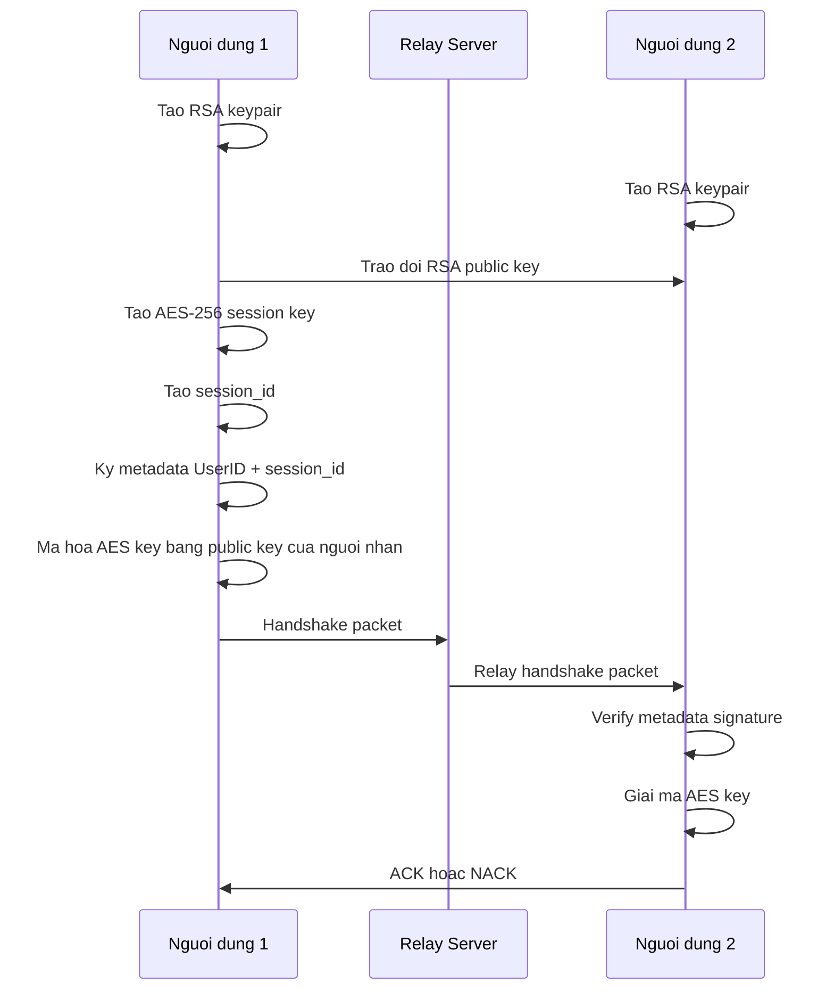
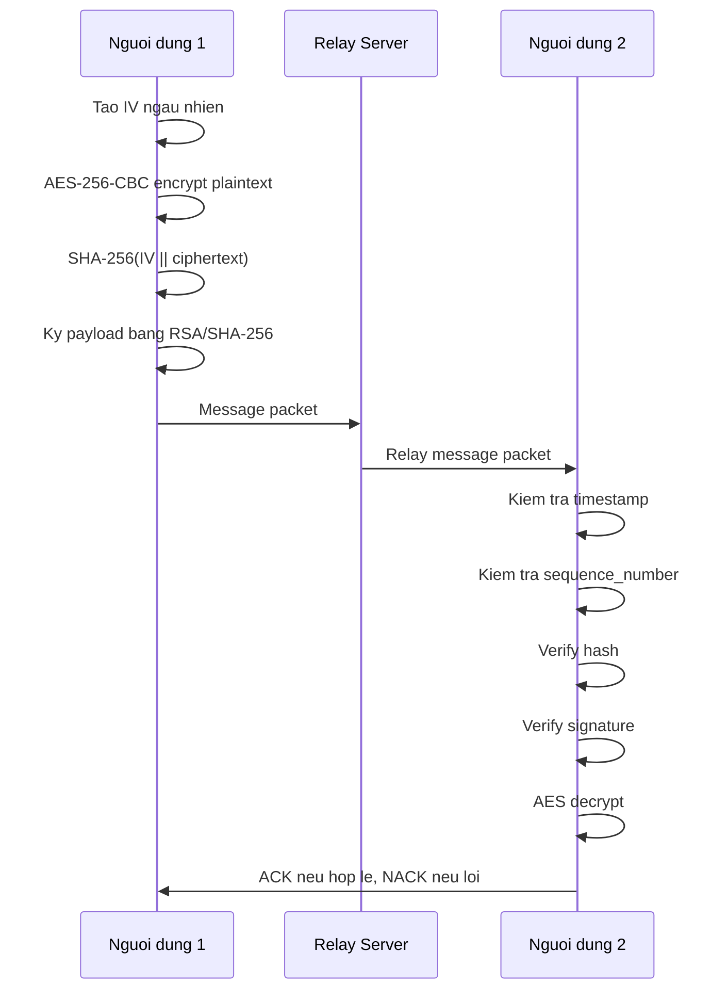

# Protocol Design - Secure Chat

## Muc tieu

Tai lieu nay mo ta giao thuc cho de tai 16: chat van ban bao mat bang AES-256-CBC, RSA-2048 va SHA-256.

Phien ban hien tai dung `node-forge` cho RSA-2048 PKCS#1 v1.5 + SHA-256, dung Web Crypto API cho AES-256-CBC va SHA-256.

## Thanh phan

| Thanh phan | Vai tro |
| --- | --- |
| Nguoi dung 1 | Nguoi gui/nhan tin nhan, dang nhap bang ID ca nhan |
| Nguoi dung 2 | Nguoi gui/nhan tin nhan, dang nhap bang ID ca nhan |
| Relay Server | Chuyen tiep packet, khong doc plaintext |
| Security Trace | Thanh ben hien thi tung buoc bao mat |

## Luong handshake



## Luong message



## Thu tu verify tai receiver

1. Kiem tra packet het han bang timestamp.
2. Kiem tra replay bang sequence number.
3. Tinh lai SHA-256 va so sanh hash.
4. Verify chu ky RSA.
5. Giai ma AES-CBC.
6. Hien thi plaintext va gui ACK.

## Packet message

```json
{
  "type": "message",
  "sender": "user_a",
  "recipient": "user_b",
  "session_id": "sess-uuid",
  "sequence_number": 1,
  "timestamp": 1710000000000,
  "iv": "<Base64>",
  "cipher": "<Base64>",
  "hash": "<hex SHA-256>",
  "signature": "<Base64 RSA signature>"
}
```

## Che do trien khai that

Trang `/` chay qua WebSocket relay that. Moi nguoi dung nhap ID ca nhan va ID nguoi nhan:

```text
http://127.0.0.1:8010/
```

Moi tab tu sinh RSA keypair, dang ky public key len server, mo WebSocket `/ws/{user_id}` va gui packet qua server. Server chi validate schema, chong sender mismatch va relay theo truong `recipient`.
