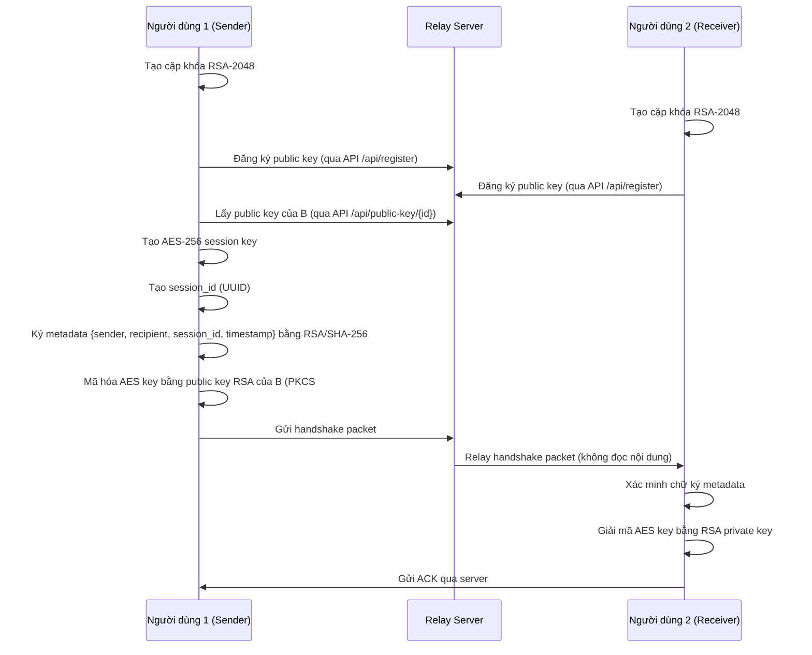
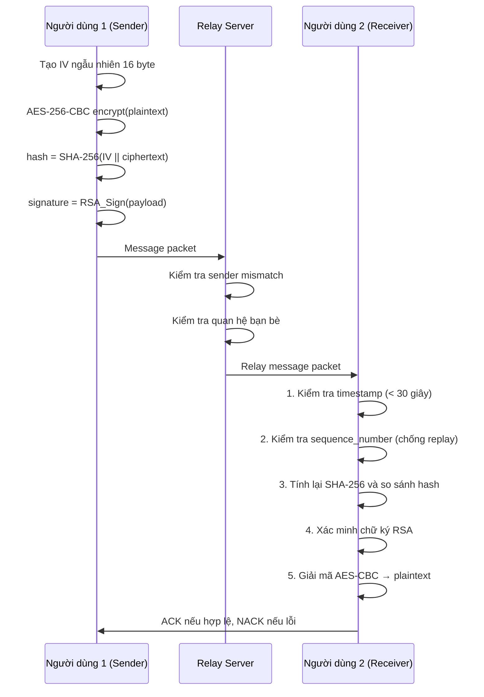
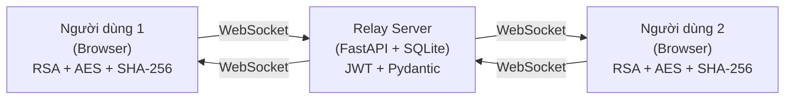

# Báo cáo Bài tập lớn

## Đề tài 16: Ứng dụng bảo mật tin nhắn văn bản với mã hóa AES và xác thực RSA

**Học phần:** Nhập môn An toàn Bảo mật Thông tin
**Năm học:** Học kì 3 năm học 2025–2026
**Nhóm:** 1 (2 thành viên)
**Thư mục dự án:** `D:\My\ATBMTT`
**Ngày cập nhật:** 06/07/2026

---

## 1. Giới thiệu bài toán

### 1.1. Bối cảnh thực tế

Ứng dụng nhắn tin văn bản qua mạng Internet luôn đối mặt với nhiều nguy cơ bảo mật nghiêm trọng:

- **Nghe lén (Eavesdropping):** Kẻ tấn công có thể chặn và đọc nội dung tin nhắn trên đường truyền.
- **Sửa đổi dữ liệu (Tampering):** Nội dung tin nhắn bị thay đổi mà người nhận không hay biết.
- **Giả mạo người gửi (Spoofing):** Kẻ tấn công tạo tin nhắn giả mạo danh tính người gửi.
- **Tấn công gửi lại (Replay Attack):** Gói tin hợp lệ cũ bị chặn và gửi lại nhiều lần.

### 1.2. Mục tiêu hệ thống

Xây dựng ứng dụng chat bảo mật chạy thật qua WebSocket, đảm bảo:

- **Tính bí mật (Confidentiality):** Tin nhắn được mã hóa đầu cuối (E2EE) bằng AES-256-CBC. Server chỉ relay gói tin đã mã hóa, không đọc được nội dung.
- **Tính toàn vẹn (Integrity):** SHA-256 hash kiểm tra toàn vẹn `SHA-256(IV || ciphertext)`. Bất kỳ thay đổi nào trên ciphertext đều bị phát hiện.
- **Xác thực (Authentication):** Chữ ký số RSA/SHA-256 xác minh danh tính người gửi cho cả metadata handshake và payload tin nhắn.
- **Chống gửi lại (Anti-replay):** Mỗi gói tin có `session_id`, `sequence_number` và `timestamp` để phát hiện packet cũ hoặc hết hạn.
- **Phản hồi rõ ràng:** ACK khi tin nhắn hợp lệ, NACK kèm lý do lỗi cụ thể khi phát hiện vi phạm bảo mật.

### 1.3. Yêu cầu đề tài

| Nhóm yêu cầu | Nội dung |
| --- | --- |
| Mã hóa nội dung | AES 256-bit, chế độ CBC |
| Trao đổi khóa & xác thực | RSA 2048-bit (PKCS#1 v1.5 + SHA-256) |
| Kiểm tra tính toàn vẹn | SHA-256 |
| Gói tin | IV, ciphertext, hash, signature |
| Phản hồi | ACK nếu hợp lệ, NACK nếu lỗi integrity/auth |
| Bổ sung | Anti-replay, test case tấn công, benchmark, threat model |

---

## 2. Mô tả thuật toán và giao thức bảo mật

### 2.1. Tổng quan thuật toán

| Thuật toán | Vai trò | Thư viện |
| --- | --- | --- |
| **RSA-2048 PKCS#1 v1.5** | Mã hóa khóa AES session, ký số metadata và payload | `node-forge` |
| **AES-256-CBC** | Mã hóa nội dung tin nhắn với IV ngẫu nhiên 16 byte | Web Crypto API |
| **SHA-256** | Tính hash toàn vẹn `SHA-256(IV \|\| ciphertext)` | Web Crypto API |
| **PBKDF2-HMAC-SHA256** | Băm mật khẩu đăng nhập (160.000 vòng lặp) | Python `hashlib` |
| **HMAC-SHA256** | JWT token xác thực WebSocket | Python `hmac` |

### 2.2. Bước 1 — Bắt tay (Handshake)



**Handshake packet:**

```json
{
  "type": "handshake",
  "sender": "#12345678",
  "recipient": "#87654321",
  "session_id": "sess-uuid-...",
  "timestamp": 1720000000000,
  "metadata": {"sender": "...", "recipient": "...", "session_id": "...", "timestamp": ...},
  "metadata_signature": "<Base64 RSA signature>",
  "encrypted_aes_key": "<Base64 RSA-encrypted AES key>"
}
```

### 2.3. Bước 2 — Xác thực và ký số (mỗi tin nhắn)

Mỗi tin nhắn đều được ký số riêng biệt:

1. Sender tạo IV ngẫu nhiên 16 byte.
2. Mã hóa nội dung bằng AES-256-CBC.
3. Tính hash toàn vẹn: `SHA-256(IV || ciphertext)`.
4. Tạo payload canonical: `{sender, recipient, session_id, sequence_number, timestamp, iv, cipher, hash}`.
5. Ký payload bằng RSA/SHA-256 PKCS#1 v1.5.

### 2.4. Bước 3 — Truyền dữ liệu và kiểm tra toàn vẹn



**Message packet:**

```json
{
  "type": "message",
  "sender": "#12345678",
  "recipient": "#87654321",
  "session_id": "sess-uuid-...",
  "sequence_number": 1,
  "timestamp": 1720000000000,
  "iv": "<Base64>",
  "cipher": "<Base64>",
  "hash": "<hex SHA-256 64 ký tự>",
  "signature": "<Base64 RSA signature>"
}
```

**Thứ tự xử lý tại receiver (quan trọng):**

1. Kiểm tra timestamp → NACK "Message expired" nếu quá 30 giây.
2. Kiểm tra sequence_number → NACK "Replay detected" nếu đã xử lý.
3. Tính lại SHA-256 và so sánh → NACK "Invalid integrity hash".
4. Xác minh chữ ký RSA → NACK "Invalid message signature".
5. Giải mã AES-CBC → hiển thị plaintext.
6. Gửi ACK "Message accepted".

---

## 3. Mô hình hiểm họa (Threat Model)

### 3.1. Tài sản cần bảo vệ

| Tài sản | Mô tả | Biện pháp bảo vệ |
| --- | --- | --- |
| Plaintext | Nội dung tin nhắn gốc | AES-256-CBC mã hóa tại client |
| AES session key | Khóa mã hóa tin nhắn | RSA-2048 mã hóa khi trao đổi |
| RSA private key | Khóa ký và giải mã | Chỉ lưu trong trình duyệt client |
| Message packet | Dữ liệu truyền qua relay | SHA-256 hash + RSA signature |
| Session state | sequence_number, session_id | Lưu trong client state |
| Mật khẩu | Thông tin đăng nhập | PBKDF2-HMAC-SHA256 (160K iterations) |

### 3.2. Tác nhân tấn công và cơ chế phòng thủ

| Tác nhân | Mục tiêu | Cách phòng thủ | NACK trả về |
| --- | --- | --- | --- |
| Kẻ nghe lén | Đọc nội dung | AES-256-CBC E2EE | (không thể đọc) |
| Kẻ sửa dữ liệu | Sửa ciphertext | SHA-256 hash mismatch | "Invalid integrity hash" |
| Kẻ giả mạo | Giả chữ ký | RSA signature verify | "Invalid message signature" |
| Kẻ replay | Gửi lại packet cũ | sequence_number | "Replay detected" |
| Sai người nhận | Chuyển packet cho user khác | RSA decrypt AES key fail | (không giải mã được) |
| Packet hết hạn | Gửi packet cũ | timestamp window 30s | "Message expired" |
| Sender mismatch | Giả mạo sender | Server kiểm tra JWT vs sender | "Sender mismatch" |

### 3.3. Giả định bảo mật

Server được tin tưởng trong việc phân phối public key. Trong hệ thống thực tế, cần bổ sung fingerprint hoặc QR code để người dùng xác minh public key ngoài kênh, giảm nguy cơ MITM.

### 3.4. Điều không được ghi log

- Plaintext tin nhắn
- Khóa AES session
- RSA private key
- Mật khẩu hoặc JWT token

---

## 4. Kiến trúc hệ thống

### 4.1. Sơ đồ kiến trúc



**Vai trò từng thành phần:**

- **Client (Browser):** Sinh RSA keypair, tạo AES session key, mã hóa/giải mã tin nhắn, ký/xác minh chữ ký. Tất cả crypto xử lý tại client.
- **Relay Server (FastAPI):** Xác thực JWT, validate packet schema, kiểm tra sender mismatch, kiểm tra quan hệ bạn bè, relay packet mã hóa. Server **không** đọc plaintext.
- **SQLite Database:** Lưu tài khoản (mật khẩu hash PBKDF2), public key, quan hệ bạn bè, tin nhắn offline (dạng packet đã mã hóa), security events.

### 4.2. Cấu trúc thư mục dự án

```text
D:\My\ATBMTT
├── frontend/                    # React frontend (Vite)
│   ├── src/
│   │   ├── App.jsx              # Entry component
│   │   ├── main.jsx             # React DOM render
│   │   ├── secureCrypto.js      # Module mật mã (RSA, AES, SHA-256)
│   │   ├── styles.css           # Glassmorphism dark theme
│   │   ├── components/          # UI components
│   │   │   ├── AuthView.jsx     # Đăng nhập / Đăng ký
│   │   │   ├── Sidebar.jsx      # Danh sách bạn bè, nhóm, tìm kiếm
│   │   │   ├── ChatWindow.jsx   # Khung chat chính
│   │   │   ├── Composer.jsx     # Ô nhập tin nhắn + emoji/GIF/sticker
│   │   │   ├── MessageBubble.jsx # Bong bóng tin nhắn
│   │   │   ├── ProfileModal.jsx # Cập nhật hồ sơ
│   │   │   ├── GroupModal.jsx   # Tạo nhóm E2EE
│   │   │   ├── GroupInfoModal.jsx # Quản lý thành viên nhóm
│   │   │   └── BottomNav.jsx    # Navigation mobile
│   │   ├── state/               # Quản lý state
│   │   │   ├── ChatContext.jsx  # Context chính (auth, crypto, WS, friends)
│   │   │   └── GroupContext.jsx # Context nhóm (group key rotation)
│   │   └── services/
│   │       └── api.js           # HTTP API wrapper
│   ├── dist/                    # Build output (serve bởi FastAPI)
│   └── vite.config.js           # Cấu hình Vite
├── server/                      # Backend Python
│   ├── main.py                  # FastAPI routes + WebSocket endpoint
│   ├── auth.py                  # JWT HMAC-SHA256 (tự viết)
│   ├── models.py                # Pydantic models (validation)
│   ├── storage.py               # SQLite CRUD + PBKDF2 password hashing
│   └── websocket_handler.py     # WebSocket connection manager + relay
├── scripts/
│   ├── crypto_selftest.js       # Kiểm tra mật mã + benchmark
│   ├── ws_relay_test.py         # Kiểm tra WebSocket relay e2e
│   ├── export_report.py         # Xuất báo cáo HTML/PDF
│   └── set_submission_links.py  # Cập nhật link nộp bài
├── docs/
│   ├── protocol-design.md       # Thiết kế giao thức
│   ├── threat-model.md          # Mô hình hiểm họa
│   ├── test-cases.md            # Kịch bản kiểm thử
│   ├── benchmark-report.md      # Báo cáo hiệu năng
│   ├── checklist.md             # Checklist triển khai
│   └── upgrade-plan.md          # Kế hoạch nâng cấp
├── data/
│   └── secure_chat.sqlite3     # SQLite database
├── report/
│   └── bao_cao_bai_tap_lon.md  # Báo cáo chính (file này)
├── submission/                  # File nộp bài
├── requirements.txt             # Python dependencies
├── package.json                 # Node.js dependencies
├── start.ps1                    # Script khởi động tự động
└── README.md                    # Hướng dẫn sử dụng
```

---

## 5. Thuật toán và thư viện sử dụng

### 5.1. Bảng tổng hợp

| Thành phần | Công nghệ | Lý do lựa chọn |
| --- | --- | --- |
| Backend | Python FastAPI | Async framework, hỗ trợ WebSocket native |
| Server runtime | Uvicorn | ASGI server hiệu năng cao |
| Database | SQLite | Nhẹ, không cần cài đặt riêng, phù hợp single-instance |
| Frontend | React + Vite | Component-based, hot reload, build nhanh |
| RSA-2048 | `node-forge` | Hỗ trợ PKCS#1 v1.5 trên browser (Web Crypto API không hỗ trợ RSA encryption PKCS#1 v1.5) |
| AES-256-CBC | Web Crypto API | Native browser API, nhanh và an toàn |
| SHA-256 | Web Crypto API | Native, không cần thư viện ngoài |
| Password hash | PBKDF2-HMAC-SHA256 (Python) | 160.000 iterations, vượt OWASP minimum, chống brute-force |
| JWT | Tự viết HMAC-SHA256 | Minimal, không dependency ngoài cho server |
| Icons | `lucide-react` | Nhẹ, modern, tree-shakeable |

### 5.2. Lý do dùng `node-forge` thay vì Web Crypto API cho RSA

Web Crypto API trên trình duyệt **không hỗ trợ** `RSAES-PKCS1-v1_5` (encryption mode) — chỉ hỗ trợ `RSA-OAEP`. Đề bài yêu cầu PKCS#1 v1.5, nên dự án dùng thư viện `node-forge` để triển khai RSA-2048 PKCS#1 v1.5 cho phần mã hóa khóa AES và ký số.

AES-256-CBC và SHA-256 vẫn dùng Web Crypto API native vì API hỗ trợ đầy đủ.

---

## 6. Phân tích mã nguồn

### 6.1. Module mật mã — `secureCrypto.js`

File `frontend/src/secureCrypto.js` (171 dòng) chứa toàn bộ logic mật mã:

**Tạo khóa RSA-2048:**

```javascript
// Tạo cặp khóa RSA-2048 bằng node-forge
export async function generateRSAKeyPair() {
  const keyPair = await new Promise((resolve, reject) => {
    forge.pki.rsa.generateKeyPair(
      { bits: 2048, e: 0x10001, workers: 0 },
      (err, pair) => (err ? reject(err) : resolve(pair))
    );
  });
  return {
    encryptKey: keyPair.publicKey,     // Dùng để mã hóa AES key
    decryptKey: keyPair.privateKey,    // Dùng để giải mã AES key
    signKey: keyPair.privateKey,       // Dùng để ký
    verifyKey: keyPair.publicKey,      // Dùng để xác minh chữ ký
    publicKeyBundle: forge.pki.publicKeyToPem(keyPair.publicKey)
  };
}
```

**Mã hóa/giải mã khóa AES bằng RSA PKCS#1 v1.5:**

```javascript
export async function encryptAESKey(rawAESKey, recipientEncryptKey) {
  const rawBytes = arrayBufferToBinaryString(rawAESKey);
  const encryptedBytes = recipientEncryptKey.encrypt(rawBytes, "RSAES-PKCS1-V1_5");
  return forge.util.encode64(encryptedBytes);
}

export async function decryptAESKey(encryptedAESKeyB64, myDecryptKey) {
  const encryptedBytes = forge.util.decode64(encryptedAESKeyB64);
  const rawBytes = myDecryptKey.decrypt(encryptedBytes, "RSAES-PKCS1-V1_5");
  return binaryStringToArrayBuffer(rawBytes);
}
```

**Ký và xác minh chữ ký RSA/SHA-256:**

```javascript
export async function signData(data, signKey) {
  const md = forge.md.sha256.create();
  md.update(data, "utf8");
  return forge.util.encode64(signKey.sign(md));
}

export async function verifySignature(signatureB64, data, verifyKey) {
  try {
    const md = forge.md.sha256.create();
    md.update(data, "utf8");
    return verifyKey.verify(md.digest().bytes(), forge.util.decode64(signatureB64));
  } catch {
    return false;
  }
}
```

**Mã hóa/giải mã tin nhắn AES-256-CBC (Web Crypto API):**

```javascript
export async function encryptMessage(plaintext, aesKey) {
  const iv = crypto.getRandomValues(new Uint8Array(16)); // IV ngẫu nhiên 16 byte
  const plaintextBuffer = new TextEncoder().encode(plaintext);
  const cipherBuffer = await crypto.subtle.encrypt(
    { name: "AES-CBC", iv }, aesKey, plaintextBuffer
  );
  return {
    iv: arrayBufferToBase64(iv.buffer),
    cipher: arrayBufferToBase64(cipherBuffer)
  };
}
```

**Kiểm tra toàn vẹn SHA-256(IV || ciphertext):**

```javascript
export async function computeIntegrityHash(ivB64, cipherB64) {
  const ivBytes = new Uint8Array(base64ToArrayBuffer(ivB64));
  const cipherBytes = new Uint8Array(base64ToArrayBuffer(cipherB64));
  const combined = new Uint8Array(ivBytes.length + cipherBytes.length);
  combined.set(ivBytes, 0);
  combined.set(cipherBytes, ivBytes.length);
  const hashBuffer = await crypto.subtle.digest("SHA-256", combined);
  return arrayBufferToHex(hashBuffer);
}
```

**So sánh hash constant-time (chống timing attack):**

```javascript
export function verifyIntegrityHash(receivedHash, computedHash) {
  if (!receivedHash || !computedHash || receivedHash.length !== computedHash.length) return false;
  let diff = 0;
  for (let index = 0; index < receivedHash.length; index += 1) {
    diff |= receivedHash.charCodeAt(index) ^ computedHash.charCodeAt(index);
  }
  return diff === 0;
}
```

### 6.2. Server relay — `server/main.py`

Server FastAPI (352 dòng) đóng vai trò relay trung gian:

- **Đăng ký/đăng nhập:** API `/api/register` và `/api/login` với mật khẩu hash PBKDF2.
- **Quản lý bạn bè:** API kết bạn bằng Chat ID dạng `#12345678`.
- **WebSocket endpoint `/ws`:** Xác thực JWT, validate packet schema (Pydantic), kiểm tra sender mismatch, kiểm tra quan hệ bạn bè, relay packet mã hóa. Server **không giải mã** nội dung.
- **Offline delivery:** Khi người nhận offline, packet mã hóa được lưu vào SQLite và gửi lại khi người nhận kết nối lại.

### 6.3. Xác thực JWT — `server/auth.py`

JWT tự viết bằng HMAC-SHA256 (71 dòng):

```python
def create_access_token(user):
    header = {"alg": "HS256", "typ": "JWT"}
    payload = {
        "sub": user["chat_id"],
        "username": user["username"],
        "exp": int(time.time()) + JWT_TTL_SECONDS,  # TTL 12 giờ
    }
    signing_input = f"{_b64_json(header)}.{_b64_json(payload)}"
    signature = _sign(signing_input)
    return f"{signing_input}.{signature}"
```

Xác minh token dùng `hmac.compare_digest()` (constant-time) để chống timing attack.

### 6.4. Lưu trữ — `server/storage.py`

SQLite schema gồm 8 bảng:

| Bảng | Vai trò |
| --- | --- |
| `app_users` | Tài khoản, mật khẩu PBKDF2, public key RSA |
| `friendships` | Quan hệ bạn bè 2 chiều (chuẩn hóa) |
| `friend_requests` | Lời mời kết bạn |
| `conversations` | Nhóm chat |
| `conversation_members` | Thành viên nhóm + role |
| `group_member_keys` | Khóa AES nhóm được mã hóa RSA cho từng thành viên |
| `messages` | Tin nhắn offline (dạng packet JSON đã mã hóa) |
| `security_events` | Log bảo mật |

Mật khẩu được hash bằng PBKDF2-HMAC-SHA256 với 160.000 iterations:

```python
def _hash_password(password: str, salt: bytes) -> str:
    digest = hashlib.pbkdf2_hmac("sha256", password.encode("utf-8"), salt, 160_000)
    return base64.b64encode(digest).decode("ascii")
```

### 6.5. Hướng dẫn chạy

```powershell
cd D:\My\ATBMTT
.\start.ps1
```

Mở trình duyệt tại `http://127.0.0.1:8010/`. Script `start.ps1` tự động: tạo Python venv, cài npm dependencies, build React, chạy Uvicorn server.

---

## 7. Chức năng đã cài đặt

### 7.1. Chức năng gốc (theo đề tài 16)

| Chức năng | Trạng thái |
| --- | --- |
| Tạo RSA-2048 keypair tại client | ✅ |
| Trao đổi public key qua server | ✅ |
| Handshake: ký metadata + mã hóa AES key bằng RSA | ✅ |
| Mã hóa tin nhắn AES-256-CBC với IV ngẫu nhiên | ✅ |
| Hash toàn vẹn SHA-256(IV \|\| ciphertext) | ✅ |
| Ký payload bằng RSA/SHA-256 | ✅ |
| Xác minh hash + signature tại receiver | ✅ |
| ACK/NACK phản hồi | ✅ |
| Anti-replay bằng sequence_number | ✅ |
| Phát hiện packet hết hạn bằng timestamp | ✅ |
| Server relay không đọc plaintext | ✅ |
| Server chặn sender mismatch | ✅ |

### 7.2. Chức năng nâng cấp (vượt yêu cầu)

| Chức năng | Mô tả |
| --- | --- |
| Đăng ký/đăng nhập tài khoản | Username + password, PBKDF2 hash |
| Chat ID unique | Server sinh `#` + 8 chữ số |
| Hệ thống kết bạn | Tìm kiếm, gửi/chấp nhận/từ chối lời mời |
| WebSocket JWT auth | Token query param, TTL 12 giờ |
| Offline message delivery | Lưu packet mã hóa vào SQLite, gửi lại khi online |
| Group chat E2EE | Tạo nhóm, key rotation khi thêm/xóa thành viên |
| Giao diện Telegram-style | Glassmorphism, dark theme, responsive mobile |
| Hồ sơ cá nhân | Display name, bio, avatar color |
| Emoji, GIF, Sticker picker | Gửi tin nhắn đa phương tiện mã hóa |
| Tìm kiếm bạn bè | Filter danh sách theo tên hoặc Chat ID |
| Security event logging | Log ra CMD + SQLite, không chứa plaintext |

---

## 8. Kiểm thử chức năng

### 8.1. Kiểm thử chạy đúng

| Test case | Thao tác | Kết quả mong đợi |
| --- | --- | --- |
| TC01 | Đăng ký 2 tài khoản | Chat ID unique được sinh |
| TC02 | Kết bạn bằng Chat ID | Hai tài khoản thành bạn bè |
| TC03 | Gửi tin nhắn hợp lệ A → B | B nhận plaintext đúng, hiển thị ACK |
| TC04 | Gửi tin ngược B → A | A nhận plaintext đúng |
| TC05 | Đăng nhập lại sau khi tắt tab | Khôi phục lịch sử chat, gửi tin bình thường |

### 8.2. Kiểm thử tự động

```powershell
# Kiểm tra mật mã + benchmark
npm run test:crypto

# Kiểm tra WebSocket relay end-to-end
npm run test:relay

# Kiểm tra cú pháp Python
.\.venv\Scripts\python.exe -m py_compile server\main.py server\models.py server\storage.py server\auth.py server\websocket_handler.py
```

Kết quả `npm run test:crypto`:

```
CRYPTO SELF-TEST: TẤT CẢ KIỂM TRA THÀNH CÔNG ✓
```

Kết quả `npm run test:relay`:

```json
{
  "status": "ok",
  "checked": [
    "register/login with jwt",
    "friend request by #id",
    "websocket jwt auth",
    "friend-only relay",
    "multiple websocket connections for one user",
    "sender mismatch nack"
  ]
}
```

---

## 9. Kiểm thử bảo mật

### 9.1. Test sửa đổi ciphertext → Hash mismatch

**Thao tác:** Sửa 1 byte trong ciphertext trước khi gửi.
**Kết quả:** Receiver tính lại `SHA-256(IV || ciphertext)`, hash không khớp → gửi NACK "Invalid integrity hash".

### 9.2. Test chữ ký sai → Signature invalid

**Thao tác:** Thay signature bằng chữ ký từ dữ liệu khác.
**Kết quả:** Receiver xác minh RSA signature thất bại → gửi NACK "Invalid message signature".

### 9.3. Test packet hết hạn → Timestamp expired

**Thao tác:** Gửi packet có timestamp cũ hơn 30 giây.
**Kết quả:** Receiver phát hiện `|now - timestamp| > 30000 ms` → gửi NACK "Message expired".

### 9.4. Test tấn công replay → Replay detected

**Thao tác:** Gửi lại packet hợp lệ đã xử lý.
**Kết quả:** Receiver phát hiện `sequence_number <= receivedSequence` → gửi NACK "Replay detected".

### 9.5. Test sender mismatch → Server từ chối

**Thao tác:** Gửi packet có sender khác với JWT user.
**Kết quả:** Server so sánh `parsed_packet.sender != chat_id` → gửi NACK "Sender mismatch".

### 9.6. Test sai người nhận

**Thao tác:** Chặn packet mã hóa và chuyển cho user C (không phải B).
**Kết quả:** User C không thể giải mã AES key vì không có RSA private key của B. Giải mã thất bại.

### 9.7. Tổng hợp kiểm thử bảo mật

| Test case | Kịch bản | NACK trả về | Kết quả |
| --- | --- | --- | --- |
| TC-SEC-01 | Sửa ciphertext | "Invalid integrity hash" | ✅ Phát hiện |
| TC-SEC-02 | Sai chữ ký | "Invalid message signature" | ✅ Phát hiện |
| TC-SEC-03 | Packet hết hạn | "Message expired" | ✅ Phát hiện |
| TC-SEC-04 | Replay packet | "Replay detected" | ✅ Phát hiện |
| TC-SEC-05 | Sender mismatch | "Sender mismatch" | ✅ Server từ chối |
| TC-SEC-06 | Sai người nhận | RSA decrypt fail | ✅ Không giải mã được |
| TC-SEC-07 | Constant-time hash compare | (timing attack resistant) | ✅ XOR bit-by-bit |

---

## 10. Benchmark hiệu năng

### 10.1. Kết quả tạo khóa

| Thao tác | Thời gian |
| --- | --- |
| RSA-2048 key generation | ~20–53 ms |
| AES-256 key generation | ~4 ms |
| RSA encrypt AES key (PKCS#1 v1.5) | ~13 ms |
| RSA decrypt AES key (PKCS#1 v1.5) | ~50 ms |

### 10.2. Kết quả xử lý tin nhắn

| Kích thước | AES encrypt | SHA-256 | RSA sign | RSA verify | AES decrypt |
| --- | --- | --- | --- | --- | --- |
| 128 B | 1,64 ms | 0,93 ms | 37,51 ms | 1,63 ms | 0,70 ms |
| 1 KB | 0,47 ms | 0,38 ms | 32,99 ms | 1,27 ms | 0,65 ms |
| 10 KB | 0,54 ms | 0,19 ms | 32,89 ms | 1,49 ms | 0,27 ms |

### 10.3. Nhận xét

- **RSA sign là thao tác chậm nhất** (~33–38 ms), do tính SHA-256 digest rồi ký bằng private key 2048-bit. Tuy nhiên chỉ ký metadata/payload nhỏ, không ký từng byte dữ liệu.
- **AES-256-CBC rất nhanh** (<2 ms), phù hợp mã hóa tin nhắn real-time.
- **SHA-256 cực nhanh** (<1 ms), chi phí kiểm tra toàn vẹn không đáng kể.
- **RSA verify nhanh hơn sign** (~1,5 ms vs ~35 ms) vì dùng public exponent nhỏ (0x10001).
- **Tổng thời gian mỗi tin nhắn:** ~35–40 ms (encrypt + hash + sign), không gây cảm nhận trễ cho người dùng.

---

## 11. Phân tích và so sánh thuật toán

### 11.1. So sánh thuật toán mã hóa đối xứng

| Tiêu chí | DES | 3DES (Triple DES) | AES-256-CBC |
| --- | --- | --- | --- |
| Kích thước khóa | 56 bit | 168 bit | 256 bit |
| Kích thước block | 64 bit | 64 bit | 128 bit |
| Độ an toàn | ❌ Yếu (brute-force khả thi) | ⚠️ Trung bình | ✅ Rất mạnh |
| Tốc độ | Nhanh | Chậm (3 lần DES) | Nhanh (hardware-accelerated) |
| Chuẩn hiện tại | Đã lỗi thời | Đang bị loại bỏ | Chuẩn NIST hiện hành |

**Lý do chọn AES-256-CBC:** Đề tài 16 yêu cầu AES. AES-256 có kích thước khóa 256-bit, chống được tấn công brute-force với công nghệ hiện tại. CBC mode phù hợp cho mã hóa tin nhắn văn bản với IV ngẫu nhiên mỗi lần.

### 11.2. So sánh thuật toán mã hóa bất đối xứng

| Tiêu chí | RSA-1024 | RSA-2048 (PKCS#1 v1.5) | RSA-2048 (OAEP) | ECDSA (P-256) |
| --- | --- | --- | --- | --- |
| Kích thước khóa | 1024 bit | 2048 bit | 2048 bit | 256 bit |
| Độ an toàn | ❌ Yếu | ✅ Đủ mạnh | ✅ Mạnh hơn | ✅ Rất mạnh |
| Tốc độ ký | Nhanh | Trung bình (~35 ms) | Trung bình | Rất nhanh |
| Vulnerability | Factoring | Bleichenbacher | Không biết | Không biết |

**Lý do chọn RSA-2048 PKCS#1 v1.5:** Đề tài 16 yêu cầu cụ thể RSA-2048 + PKCS#1 v1.5 + SHA-256. Trong thực tế, RSA-OAEP hoặc ECDSA an toàn hơn.

### 11.3. So sánh hàm băm

| Tiêu chí | MD5 | SHA-1 | SHA-256 |
| --- | --- | --- | --- |
| Kích thước output | 128 bit | 160 bit | 256 bit |
| Collision resistance | ❌ Đã bị phá | ❌ Đã bị phá | ✅ An toàn |
| Tốc độ | Rất nhanh | Nhanh | Nhanh |

**Lý do chọn SHA-256:** Đề tài yêu cầu SHA-256. Đây là hàm băm chuẩn NIST, chưa có tấn công collision thực tế nào.

---

## 12. Kết luận và hướng phát triển

### 12.1. Kết luận

Dự án đã xây dựng thành công ứng dụng chat bảo mật chạy thật qua WebSocket relay theo đề tài 16 với đầy đủ các yêu cầu:

- **Mã hóa AES-256-CBC** với IV ngẫu nhiên cho mỗi tin nhắn.
- **RSA-2048 PKCS#1 v1.5** trao đổi khóa AES và ký số.
- **SHA-256** kiểm tra toàn vẹn `SHA-256(IV || ciphertext)`.
- **Anti-replay** bằng sequence_number và timestamp.
- **ACK/NACK** phản hồi chi tiết lý do lỗi.
- **Server relay** chỉ chuyển tiếp, không đọc plaintext.
- Các test case bảo mật chứng minh phát hiện thành công: sửa ciphertext, sai chữ ký, replay, packet hết hạn, sender mismatch.

Ngoài ra, dự án đã nâng cấp vượt yêu cầu: hệ thống đăng ký/đăng nhập, kết bạn bằng Chat ID, group chat E2EE với key rotation, offline delivery, giao diện Telegram-style glassmorphism responsive.

### 12.2. Hạn chế

- **Không có Forward Secrecy:** Nếu RSA private key bị lộ, tất cả tin nhắn trong session đó bị giải mã.
- **Server trust cho public key:** Server được tin tưởng phân phối public key. Trong thực tế cần fingerprint/QR code xác minh ngoài kênh.
- **Private key lưu localStorage:** Có rủi ro nếu trình duyệt bị xâm nhập (XSS). Trong sản phẩm thực cần mã hóa bằng password-derived key.
- **RSA PKCS#1 v1.5:** Có vulnerability Bleichenbacher attack. Trong thực tế nên dùng RSA-OAEP.

### 12.3. Hướng phát triển

1. **Perfect Forward Secrecy:** Triển khai Double Ratchet (chuẩn Signal) để xoay khóa AES sau mỗi tin nhắn.
2. **RSA-OAEP hoặc ECDSA:** Nâng cấp lên thuật toán an toàn hơn.
3. **AES-GCM:** Chuyển sang AEAD mode tích hợp xác thực.
4. **Public key fingerprint:** QR code hoặc fingerprint để xác minh ngoài kênh.
5. **Gửi file/hình ảnh mã hóa:** Upload file đã mã hóa lên server.
6. **Rate limiting:** Chống brute-force cho endpoint đăng nhập.
7. **Deploy online:** HTTPS + WSS trên VPS/Render/Fly.io.

---

## Phụ lục

### A. Lệnh kiểm tra trước khi nộp

```powershell
npm run build
npm run test:crypto
npm run test:relay
.\.venv\Scripts\python.exe -m py_compile server\main.py server\models.py server\storage.py server\auth.py server\websocket_handler.py
```

### B. Kịch bản trình bày (5–7 phút)

1. Chạy server: `.\start.ps1`.
2. Mở 2 tab tại `http://127.0.0.1:8010/`.
3. Đăng ký 2 tài khoản, kết bạn bằng Chat ID.
4. Gửi tin nhắn hợp lệ hai chiều → ACK.
5. Demo sửa ciphertext → NACK "Invalid integrity hash".
6. Demo sai chữ ký → NACK "Invalid message signature".
7. Demo packet hết hạn → NACK "Message expired".
8. Demo replay → NACK "Replay detected".
9. Chạy `npm run test:crypto` → kết quả benchmark.
10. Chạy `npm run test:relay` → kết quả relay test.

### C. Link nộp bài

| Hạng mục | Link |
| --- | --- |
| GitHub repository | (Cập nhật sau khi upload) |
| Video trình bày | (Cập nhật sau khi upload) |
